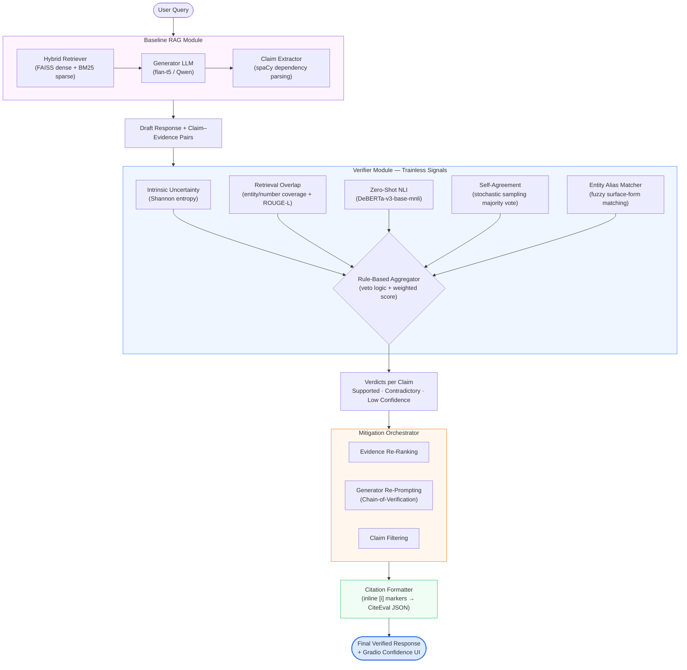

# Hallucination Detection & Mitigation for LLMs

A research pipeline for detecting and mitigating factual hallucinations in Large Language Model (LLM) outputs, with a focus on Retrieval-Augmented Generation (RAG) scenarios where models cite references to support claims.

The core contribution is a **trainless, multi-signal verifier ensemble** that combines zero-shot signals — intrinsic token entropy, self-agreement, retrieval-grounded heuristics, and zero-shot NLI — without requiring any fine-tuning or a large judge model.

---

## Table of Contents

- [System Architecture](#system-architecture)
- [Requirements](#requirements)
- [Installation](#installation)
- [Data Preparation](#data-preparation)
- [Usage](#usage)
  - [Interactive Demo (Gradio UI)](#interactive-demo-gradio-ui)
  - [Baseline RAG Demo](#baseline-rag-demo)
  - [RAGTruth Evaluation](#ragtruth-evaluation)
  - [CiteBench/CiteEval Evaluation](#citebenchciteeval-evaluation)
- [Project Structure](#project-structure)
- [Configuration](#configuration)
- [Benchmarks & Evaluation](#benchmarks--evaluation)
- [Testing](#testing)

---

## System Architecture

The pipeline is composed of four major stages:



**Verifier signals:**
| Signal | Module | Description |
|---|---|---|
| Intrinsic Uncertainty | `IntrinsicUncertaintyDetector` | Shannon entropy over token vocab during generation |
| Retrieval Overlap | `RetrievalGroundedDetector` | Entity/number coverage + ROUGE-L against evidence |
| Zero-Shot NLI | `NLIDetector` | `MoritzLaurer/DeBERTa-v3-base-mnli-fever-anli` entailment/contradiction |
| Self-Agreement | `SelfAgreementDetector` | Majority vote across *k* stochastic samples |

---

## Requirements

- Python **3.12** (exact, enforced by `pyproject.toml`)
- NVIDIA GPU with CUDA 12.6+ recommended (RTX 3070 Ti or better); CPU-only is supported but slow
- ~30 GB disk space for the development Wikipedia index; production index requires ~300 GB

**Core dependencies** (managed via `uv`):

| Package | Version |
|---|---|
| PyTorch | 2.9.0+cu126 |
| Transformers | 4.56.2 |
| sentence-transformers | 5.1.1 |
| faiss-cpu | 1.12.0 |
| rank-bm25 | ≥ 0.2.2 |
| spaCy | 3.8.7 |
| Gradio | ≥ 4.0 |
| datasets | 4.1.1 |

---

## Installation

### 1. Clone the repository

```bash
git clone https://github.com/xiashuidaolaoshuren/AIST-FYP.git
cd AIST-FYP
```

### 2. Install `uv` (recommended)

```bash
pip install uv
```

### 3. Create the virtual environment and install dependencies

```bash
uv sync
```

This installs all dependency groups (`dev`, `notebook`, `citeeval`) defined in `pyproject.toml`.

### 4. Download the spaCy language model

```bash
uv run python -m spacy download en_core_web_sm
```

### 5. Verify GPU access (optional)

```bash
uv run python scripts/verify_gpu.py
```

> **CPU-only alternative:** Replace CUDA torch wheels with CPU variants before syncing:
> ```bash
> pip install torch torchvision torchaudio --index-url https://download.pytorch.org/whl/cpu
> pip install -r requirements.txt
> ```

---

## Data Preparation

Data preparation runs in three sequential steps. Choose a **strategy** that matches your hardware:

| Strategy | Articles | FAISS index size | Use case |
|---|---|---|---|
| `development` | ~10 000 | ~200 MB | Local smoke tests |
| `validation` | ~200 000 | ~3 GB | Benchmark evaluation |
| `production` | Full dump | ~50 GB | Research-grade runs |

### Step 1 – Download Wikipedia

```bash
# Development (fast, from Hugging Face Datasets)
uv run python scripts/download_wikipedia.py --strategy development

# Production (full XML dump, ~20 GB download)
uv run python scripts/download_wikipedia.py --strategy production
```

### Step 2 – Chunk Wikipedia text

```bash
uv run python scripts/prepare_wikipedia_chunks.py --strategy development
```

### Step 3 – Generate embeddings and build indices

```bash
# Generate dense embeddings
uv run python scripts/generate_embeddings.py --strategy development

# Build FAISS index
uv run python scripts/build_faiss_index.py --strategy development

# Build BM25 index
uv run python scripts/build_bm25_index.py --strategy development
```

After these steps the `data/` directory will contain:

```
data/
├── raw/          wiki_sample_development.jsonl
├── processed/    wiki_chunks_development.jsonl
├── embeddings/   wiki_embeddings_development.npy  +  metadata_development.json
└── indexes/
    └── development/
        ├── faiss.index
        ├── metadata.pkl
        ├── index_config.json
        └── bm25_index.pkl
```

### Benchmark datasets

**RAGTruth** and **CiteBench** datasets are expected under `benchmark/`:

```
benchmark/
├── RAGTruth/      # hallucination annotations for RAG outputs
└── CiteEval/      # citation quality benchmark
```

Download them from their respective official repositories and place them here. No preprocessing script is required — the evaluation harnesses load them directly.

---

## Usage

### Interactive Demo (Gradio UI)

Launch the full pipeline with a Gradio web interface for interactive claim verification:

```bash
uv run python scripts/demo_full_pipeline.py --strategy development
```

Open `http://localhost:7860` in your browser. Each claim in the generated answer is colour-coded:

- 🟢 **Green** — Supported (high confidence, grounded in evidence)
- 🟡 **Yellow** — Low Confidence (insufficient or ambiguous evidence)
- 🔴 **Red** — Contradictory (conflicts with retrieved evidence)

Expand any claim row for a full breakdown of all four detector signals.

**CLI options:**

| Flag | Default | Description |
|---|---|---|
| `--strategy` | auto-detect | `development` / `validation` / `production` |
| `--config` | `config.yaml` | Path to configuration file |
| `--share` | off | Create a public Gradio share link |
| `--server-port` | `7860` | Port to bind the UI server |
| `--force-non-interactive` | off | Skip strategy selection prompt (useful in Colab) |

### Baseline RAG Demo

Run the end-to-end RAG pipeline without the UI and export results to JSON:

```bash
uv run python scripts/demo_baseline_rag.py --strategy development
```

### RAGTruth Evaluation

Evaluate the verifier's hallucination detection accuracy against the RAGTruth benchmark:

```bash
# Quick smoke test (10 samples)
uv run python scripts/demo_ragtruth_eval.py --max-samples 10

# Full test split
uv run python scripts/demo_ragtruth_eval.py --split test --save-results
```

To evaluate the mitigation strategies:

```bash
uv run python scripts/evaluate_mitigation_ragtruth.py --max-samples 50
```

### CiteBench/CiteEval Evaluation

Evaluate citation quality on the CiteBench system track:

```bash
# Single method
uv run python scripts/evaluate_citebench_method.py

# Full mitigation ablation (verifier-only vs mitigation-only vs full pipeline)
uv run python scripts/evaluate_mitigation_citebench.py --max-samples 10
```

### Running in Google Colab

See [`colab/README.md`](colab/README.md) for instructions on launching notebooks and the Gradio UI from Colab. Key notebooks:

| Notebook | Purpose |
|---|---|
| `colab_wikipedia_preprocessing.ipynb` | Full Wikipedia preprocessing on Colab GPU |
| `colab_ragtruth_baseline.ipynb` | Reproduce RAGTruth baseline metrics |
| `colab_demo_rag_longt5.ipynb` | Baseline RAG demo with LongT5 |

---

## Project Structure

```
AIST-FYP/
├── config.yaml                  # Main configuration file
├── pyproject.toml               # Dependency management (uv)
├── requirements.txt             # Legacy pip compatibility manifest
│
├── src/
│   ├── pipelines/
│   │   └── baseline_rag.py      # End-to-end RAG pipeline
│   ├── retrieval/
│   │   ├── dense_retriever.py   # FAISS-based semantic retrieval
│   │   ├── bm25_retriever.py    # BM25 sparse retrieval
│   │   ├── hybrid_retriever.py  # RRF/linear fusion of dense + sparse
│   │   ├── faiss_index_manager.py
│   │   └── sentence_retriever.py
│   ├── generation/
│   │   ├── generator_wrapper.py # LLM inference + token logit capture
│   │   └── claim_extractor.py   # spaCy dependency parsing → atomic claims
│   ├── verification/
│   │   ├── verifier_hub.py          # Central detector orchestration
│   │   ├── intrinsic_uncertainty.py # Entropy-based uncertainty
│   │   ├── retrieval_grounded.py    # Entity/number coverage + ROUGE-L
│   │   ├── nli_detector.py          # DeBERTa-v3 zero-shot NLI
│   │   ├── self_agreement.py        # Stochastic sampling consistency
│   │   ├── entity_matcher.py        # Fuzzy entity alias resolution
│   │   └── rule_based_aggregator.py # Veto-logic + weighted aggregation
│   ├── mitigation/
│   │   ├── orchestrator.py      # Goal-oriented mitigation dispatcher
│   │   ├── policy_router.py     # Mode selection (balanced/accuracy/citation)
│   │   ├── re_ranker.py         # Evidence re-ranking by verification scores
│   │   ├── reprompt.py          # Chain-of-Verification re-prompting
│   │   └── claim_filter.py      # Contradictory claim suppression
│   ├── citation/
│   │   └── citation_formatter.py # Inline [i] injection + CiteEval export
│   ├── evaluation/
│   │   ├── ragtruth_evaluator.py  # RAGTruth precision/recall/F1
│   │   └── composite_scorer.py   # Multi-metric composite index
│   ├── data_processing/
│   │   ├── wiki_parser.py        # Wikipedia XML dump cleaner
│   │   ├── text_chunker.py       # spaCy sentence-level chunking
│   │   └── embedding_generator.py
│   └── ui/
│       ├── confidence_ui.py      # Gradio confidence visualization
│       └── controlled_ui.py     # Advanced per-signal debugging view
│
├── scripts/                     # Standalone runnable scripts
│   ├── download_wikipedia.py
│   ├── prepare_wikipedia_chunks.py
│   ├── generate_embeddings.py
│   ├── build_faiss_index.py
│   ├── build_bm25_index.py
│   ├── demo_baseline_rag.py
│   ├── demo_full_pipeline.py
│   ├── demo_ragtruth_eval.py
│   ├── evaluate_mitigation_ragtruth.py
│   ├── evaluate_mitigation_citebench.py
│   ├── evaluate_citebench_method.py
│   ├── evaluate_verifier_signals.py
│   ├── analyze_eval_fp_tradeoffs.py
│   └── verify_gpu.py
│
├── benchmark/
│   ├── RAGTruth/                # RAGTruth hallucination benchmark
│   └── CiteEval/                # CiteBench citation quality benchmark
│
├── data/                        # Generated artifacts (git-ignored)
│   ├── raw/                     # Downloaded Wikipedia samples
│   ├── processed/               # Chunked Wikipedia text
│   ├── embeddings/              # Dense embedding arrays
│   └── indexes/                 # FAISS + BM25 indices
│
├── colab/
│   ├── notebooks/               # Colab-compatible Jupyter notebooks
│   └── env/                     # Minimal uv project for Colab
│
├── tests/
│   ├── unit/                    # Fast isolated component tests
│   ├── integration/             # End-to-end pipeline tests
│   └── fixtures/                # Shared test data
│
├── reference/                   # Research paper summaries
├── docs/                        # Extended documentation
└── logs/                        # Runtime log files
```

---

## Configuration

All runtime parameters are controlled through `config.yaml`. Key sections:

```yaml
models:
  sentence_transformer: "sentence-transformers/all-MiniLM-L6-v2"
  generator: "google/flan-t5-base"  # or "Qwen/Qwen3-4B-Instruct-2507"

retrieval:
  mode: "hybrid"          # "dense" | "bm25" | "hybrid"
  top_k: 5
  hybrid:
    alpha: 0.7            # weight for dense scores (0 = BM25 only, 1 = dense only)
    fusion_method: "linear"  # "linear" | "rrf"

generation:
  max_new_tokens: 512
  temperature: 0.2

verification:
  enabled: true
  verify_all_evidence: false   # true = verify each claim against all chunks

mitigation:
  enabled: true
  mode: "balanced"        # "balanced" | "accuracy" | "citation"
```

See `config.yaml` for the full reference including BM25 tuning parameters, FAISS index type (`FLAT` / `IVFFLAT` / `HNSW`), and retrieval guardrails.

---

## Benchmarks & Evaluation

### RAGTruth

Evaluates the verifier's ability to detect hallucinated spans in RAG-generated answers (sentence-level binary classification).

**Metrics:** Precision · Recall · F1 · Accuracy

```bash
uv run python scripts/demo_ragtruth_eval.py --split test --save-results
```

### CiteBench / CiteEval

Evaluates citation accuracy of the full pipeline in two modes:
- **Full mode** — answer quality without citation markers
- **Cited mode** — answer quality with inline `[i]` citation markers

```bash
uv run python scripts/run_citebench_eval.py
```

### Ablation Study

Disable individual detectors to quantify their contribution:

```bash
uv run python scripts/evaluate_verifier_signals.py
```

Systematically sets each signal to disabled in a config copy and measures the delta in F1 on RAGTruth.

---

## Testing

```bash
# Run all tests
uv run pytest

# Unit tests only (fast, no external dependencies)
uv run pytest tests/unit/

# Integration tests (requires FAISS index + model weights)
uv run pytest tests/integration/

# With verbose output
uv run pytest -v
```

Test configuration is defined in `pytest.ini`.

---

## Reference Papers

Key papers underlying the design choices in this project (summaries in `reference/`):

| Paper | Relevance |
|---|---|
| [SelfCheckGPT](https://arxiv.org/abs/2303.08896) | Self-agreement signal design |
| [Chain-of-Verification (CoVe)](https://arxiv.org/abs/2309.11495) | Re-prompting mitigation strategy |
| [RAGTruth](https://arxiv.org/abs/2401.00396) | Primary evaluation benchmark |
| [TRUE](https://arxiv.org/abs/2204.04991) | NLI-based factual consistency evaluation |
| [SummaC](https://arxiv.org/abs/2111.09525) | NLI inconsistency detection baseline |
| [CiteEval](https://arxiv.org/abs/2406.00975) | Citation quality evaluation framework |
| [Self-RAG](https://arxiv.org/abs/2310.11511) | Self-reflective retrieval reference |

---

## Acknowledgements

This project was developed as a Final Year Project for the AI: Systems & Technologies programme. It uses open-source models from [Hugging Face](https://huggingface.co) and knowledge data from [Wikimedia](https://dumps.wikimedia.org).
