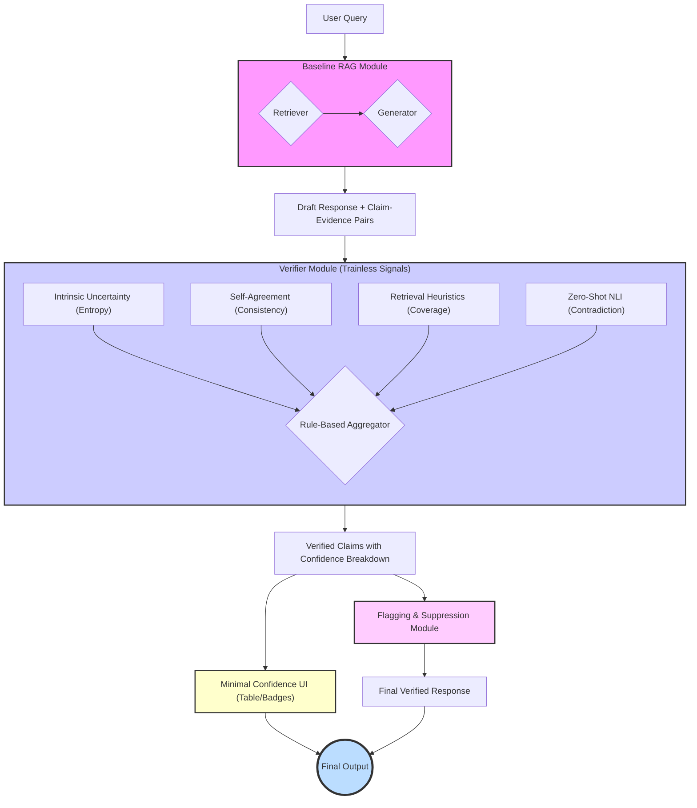

# System Architecture: Trainless Verifier & Simplified UI

This document outlines a redesigned architecture focused on a **trainless, multi-signal verifier** for hallucination detection. The design prioritizes modular, zero-shot techniques and defers complex training and UI elements.

## High-Level Pipeline Flowchart

This diagram illustrates the updated data flow, emphasizing the parallel, trainless signals within the Verifier and the simplified mitigation and UI components.



---

## Module-by-Module Design

### 1. Baseline RAG Module
*(This module's core function remains the same, but it now passes token-level metadata to the Verifier.)*

-   **Inputs:**
    -   `user_query`: (string) The input prompt from the user.
-   **Process:**
    1.  **Retrieve:** The retriever fetches relevant documents.
    2.  **Generate:** The generator LLM produces a draft response, while capturing token-level metadata (e.g., logits for entropy calculation).
    3.  **Decompose & Pair:** The draft is decomposed into atomic claims, creating direct `(claim, evidence)` pairs.
-   **Outputs:**
    -   `draft_response`: (string) The full, unverified draft response.
    -   `claim_evidence_pairs`: (List[dict]) A list where each dictionary contains the `claim`, the `evidence` document, and `generator_metadata`.

### 2. Verifier Module (Trainless Signal Hub)

This module is redesigned as a hub for calculating multiple, parallel, trainless confidence signals.

-   **Inputs:**
    -   `claim_evidence_pairs`: (List[dict]) The output from the Baseline RAG Module.

-   **Process & Sub-components:**
    1.  For each `(claim, evidence)` pair, the following sub-components run in parallel:
        -   **Intrinsic Uncertainty:** Analyzes `generator_metadata`.
            -   **Output:** `entropy_score` (e.g., length-normalized negative log-likelihood).
        -   **Self-Agreement (Conditional):** If enabled, generates `k` response samples.
            -   **Output:** `consistency_score` (e.g., variance or disagreement across samples).
        -   **Retrieval-Grounded Heuristics:**
            -   **Process:** Calculates `evidence_coverage` (percentage of claim entities in evidence) and `citation_integrity` (token overlap for cited spans).
            -   **Output:** A dictionary of heuristic scores.
        -   **Zero-Shot NLI:** Uses an off-the-shelf NLI model.
            -   **Process:** Labels each `(claim, evidence_sentence)` pair as Entail/Contradict/Neutral.
            -   **Output:** Aggregated NLI scores (e.g., `max_contradiction_prob`, `entailment_ratio`).
    2.  **Rule-Based Aggregator:** Gathers all signals into a structured breakdown using explicit rules. No trainable fusion logic is used at this stage.

-   **Outputs:**
    -   `verified_claims`: (List[dict]) A list where each dictionary contains:
        -   `claim`: (string) The original atomic claim.
        -   `evidence`: (dict) The associated evidence.
        -   `confidence_breakdown`: (dict) A structured dictionary containing all raw signals (e.g., `entropy_score`, `nli_results`, `coverage_score`).
        -   `final_verdict`: (string) A final verdict (e.g., "Supported", "Contradictory", "Low Confidence") derived from the rule-based aggregator.

### 3. Flagging & Suppression Module (Simplified Mitigation)

This module applies simple, rule-based actions based on the final verdict from the verifier.

-   **Inputs:**
    -   `draft_response`: (string) The original draft.
    -   `verified_claims`: (List[dict]) The output from the Verifier Module.

-   **Process:**
    1.  Iterates through the `verified_claims` and assembles the final response.
    2.  Applies simple rules based on the `final_verdict`:
        -   **If "Contradictory"**: The claim is suppressed or replaced with a warning (e.g., "[Warning: The following claim contradicts the source]"). No complex rewrite loop is implemented.
        -   **If "Low Confidence"**: The claim is flagged with a visual indicator.
        -   **If "Supported"**: The claim is included as is, with its citation.

-   **Outputs:**
    -   `final_response`: (string) The final text with flags and (optional) suppressions.

### 4. Minimal Confidence UI (Table/Badges)

This module provides a simple, transparent view of the confidence signals.

-   **Inputs:**
    -   `verified_claims`: (List[dict]) The output from the Verifier Module.

-   **Process:**
    1.  Displays the final response with clear visual cues (e.g., colored highlights or badges) for each claim based on its `final_verdict`.
    2.  On hover or click, a simple table or list appears, showing the raw values from the `confidence_breakdown` for that claim (e.g., "Entropy: 0.85", "NLI Contradiction: 0.92", "Coverage: 0.65").
    3.  No complex visualizations like radial or donut charts are used at this stage.

-   **Outputs:**
    -   An interactive user interface that allows users to inspect the raw, multi-dimensional evidence behind each claim's confidence level.

---
*Interface for Future Training:* The `Verifier Module` is designed to be extensible. Each trainless signal component can be replaced by a trained model in the future. The `Rule-Based Aggregator` can be swapped with a trainable `Ensemble Fusion Logic` that learns to weigh the signals optimally, without changing the overall architecture.

---

## Data Structures (IO Payloads)

The following JSON-like structures define the key data objects passed between the modules in the pipeline.

### Query
Represents the initial input from the user.
```json
{
  "id": "q_20250201_001",
  "text": "Who founded the FEVER dataset project?",
  "timestamp": "2025-02-01T10:10:10Z"
}
```

### EvidenceChunk
A single piece of text retrieved from the knowledge corpus.
```json
{
  "doc_id": "enwiki_12345",
  "sent_id": 17,
  "text": "The FEVER dataset was introduced in 2018 by...",
  "char_start": 210,
  "char_end": 265,
  "score_bm25": 7.43,
  "score_dense": 0.62,
  "score_hybrid": 0.69,
  "rank": 3,
  "source": "wikipedia",
  "version": "wiki_sent_v1"
}
```

### Claim
An atomic, verifiable statement extracted from the LLM's draft response.
```json
{
  "claim_id": "c_0007",
  "answer_id": "ans_001",
  "text": "The FEVER dataset was introduced in 2018.",
  "answer_char_span": [134, 175],
  "extraction_method": "rule_sentence_split_v1"
}
```

### ClaimEvidencePair
Associates a claim with its corresponding retrieved evidence.
```json
{
  "claim_id": "c_0007",
  "evidence_candidates": ["enwiki_12345#17","enwiki_77889#04"],
  "top_evidence": "enwiki_12345#17",
  "evidence_spans": [
    {"doc_id": "enwiki_12345", "sent_id": 17, "text": "The FEVER dataset was introduced in 2018...", "rank": 3}
  ]
}
```

### CitationFormatterOutput
Result of post-processing a generated answer to add inline bracketed citations and to prepare passages for external evaluators (e.g., CiteEval/CiteBench). This does not alter retrieval or verifier logic.
```json
{
  "formatted_text": "The FEVER dataset was introduced in 2018. [1]",
  "citation_map": {
    "c_0007": [1]
  },
  "passages": [
    {"text": "The FEVER dataset was introduced in 2018 by...", "title": "FEVER"},
    {"text": "FEVER is a benchmark for fact verification.", "title": "FEVER"}
  ],
  "notes": {
    "merged_redundant": true,
    "method": "right_span_insertion_v1"
  }
}
```
Fields:
- `formatted_text`: Answer with inline citations using 1-based indices `[i]` that refer to `passages[i-1]`.
- `citation_map`: Mapping from `claim_id` to the list of passage indices used inside that claim’s span.
- `passages`: Ordered list derived from ranked evidence chunks; each item contains at least `text`, and optionally `title` if available from metadata.
- `notes` (optional): Diagnostics such as merges, drops, or formatter strategy used.

### CiteEvalSystemExample
Adapter object for CiteEval “System Evaluation”. Produced from `CitationFormatterOutput` without changing core architecture.
```json
{
  "id": "ex_0001",
  "query": "Who introduced the FEVER dataset?",
  "passages": [
    {"text": "The FEVER dataset was introduced in 2018 by...", "title": "FEVER"},
    {"text": "FEVER is a benchmark for fact verification.", "title": "FEVER"}
  ],
  "pred": "The FEVER dataset was introduced in 2018. [1]"
}
```
Notes:
- Indices in `pred` are 1-based and must align with the order of `passages`.
- This object enables CiteEval “Full” (citations optional) and “Cited” (citations required) modes.

### VerifierSignal
The raw output of a single detector signal for a given claim-evidence pair.
```json
{
  "claim_id": "c_0007",
  "doc_id": "enwiki_12345",
  "sent_id": 17,
  "nli": {"entail": 0.81, "contradict": 0.03, "neutral": 0.16},
  "coverage": {"entities": 0.83, "numbers": 1.0, "tokens_overlap": 0.74},
  "uncertainty": {"mean_entropy": 1.12},
  "consistency": {"variance": null},
  "citation_span_match": 0.9,
  "numeric_check": true
}
```

### ClaimDecision
The final, aggregated verdict for a single claim after all verifier signals have been processed.
```json
{
  "claim_id": "c_0007",
  "status": "Supported",
  "rationale": "High entail prob, good entity coverage",
  "primary_evidence": "enwiki_12345#17",
  "signals_ref": ["sig_c_0007_17"],
  "confidence": {
    "support_prob": 0.81,
    "contradict_prob": 0.03,
    "overall_confidence": 0.74,
    "band": "High"
  }
}
```

### AnnotatedAnswer
The final output object, containing the full answer annotated with decisions for each claim.
```json
{
  "answer_id": "ans_001",
  "query_id": "q_20250201_001",
  "raw_answer": "…",
  "claims": "[ClaimDecision, ...]",
  "summary_stats": {
    "claims_total": 9,
    "supported_high": 5,
    "supported_low": 1,
    "contradicted": 1,
    "insufficient": 2,
    "mean_overall_confidence": 0.61
  },
  "mitigation_actions": ["removed_contradicted_claims"],
  "version": "pipeline_v0.3"
}
```
