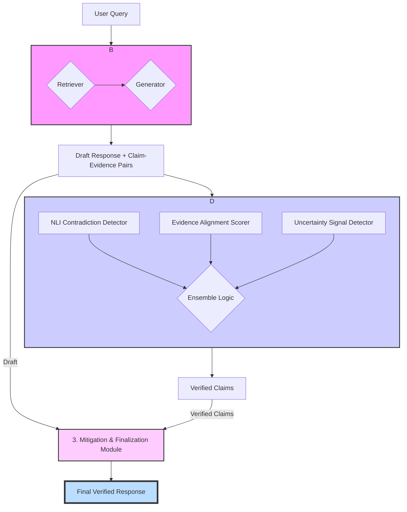

# System Architecture: A Simplified Generator-Retriever-Verifier Pipeline

This document outlines a redesigned, simplified architecture for the hallucination detection and mitigation pipeline. The new design emphasizes a more linear, three-stage process to align more closely with the project roadmap and reduce complexity.

## High-Level Pipeline Flowchart

This diagram illustrates the simplified, end-to-end data flow.

---

## Module-by-Module Design

### 1. Baseline RAG Module

This module integrates the retrieval and generation steps into a single component, responsible for producing a draft response and the direct evidence used for its claims.

-   **Inputs:**
    -   `user_query`: (string) The input prompt from the user.

-   **Process:**
    1.  **Retrieve:** The hybrid retriever (BM25 + dense) fetches a set of relevant documents from the knowledge base (e.g., FAISS vector database) based on the `user_query`.
    2.  **Generate:** The generator LLM is prompted with the `user_query` and the content of the retrieved documents. It produces a draft response.
    3.  **Decompose & Pair:** The draft is decomposed into atomic claims. For each claim, the module identifies which of the retrieved documents was most likely used to generate it, creating direct `(claim, evidence)` pairs.

-   **Outputs:**
    -   `draft_response`: (string) The full, unverified draft response.
    -   `claim_evidence_pairs`: (List[dict]) A list where each dictionary contains:
        -   `claim`: (string) The atomic claim.
        -   `evidence`: (dict) The evidence document used, containing `content`, `source_id`, and `span`.

### 2. Verifier Module (Plug-and-Play)

This module acts as a self-contained "plug-and-play" unit that assesses the factuality of each claim-evidence pair.

-   **Inputs:**
    -   `claim_evidence_pairs`: (List[dict]) The output from the Baseline RAG Module.

-   **Process:**
    1.  For each `(claim, evidence)` pair, the following three sub-components run in parallel:
        -   **NLI Contradiction Detector:** A fine-tuned NLI model classifies the relationship between the claim and evidence as "entailment," "neutral," or "contradiction."
        -   **Evidence Alignment Scorer:** A classifier scores how well the evidence supports the claim, producing a score for "supported," "refuted," or "not_enough_info."
        -   **Uncertainty Signal Detector:** An uncertainty score is calculated based on the generator's confidence (e.g., token entropy from the RAG module's generation process) and/or self-consistency checks.
    2.  **Ensemble Logic:** The outputs from the three sub-modules are fed into a simple, weighted heuristic or a meta-classifier to determine a final verification status for the claim.

-   **Outputs:**
    -   `verified_claims`: (List[dict]) A list where each dictionary contains:
        -   `claim`: (string) The original atomic claim.
        -   `evidence`: (dict) The associated evidence.
        -   `status`: (string) The final verification label: "Supported", "Contradictory", or "Insufficient_Info".

### 3. Mitigation & Finalization Module

This final module constructs the trustworthy response for the user by applying clear, rule-based corrections.

-   **Inputs:**
    -   `draft_response`: (string) The original draft from the RAG Module.
    -   `verified_claims`: (List[dict]) The output from the Verifier Module.

-   **Process:**
    1.  The module iterates through the `verified_claims`.
    2.  It builds the final response by applying a set of mitigation rules:
        -   If a claim's status is **"Supported"**: The claim is included in the final text, and a citation pointing to the `evidence` is appended.
        -   If a claim's status is **"Contradictory"**: The claim is either corrected based on the evidence or replaced with a warning statement (e.g., "An initial claim about X was found to be incorrect and has been removed.").
        -   If a claim's status is **"Insufficient_Info"**: The claim is rephrased to reflect uncertainty (e.g., "It is suggested that Y, but this could not be fully verified.") or omitted, depending on the desired level of strictness.
    3.  The module assembles the final, coherent response, complete with inline citations and a formatted reference list at the end.

-   **Outputs:**
    -   `final_response`: (string) The final, polished, and verified text presented to the user.
