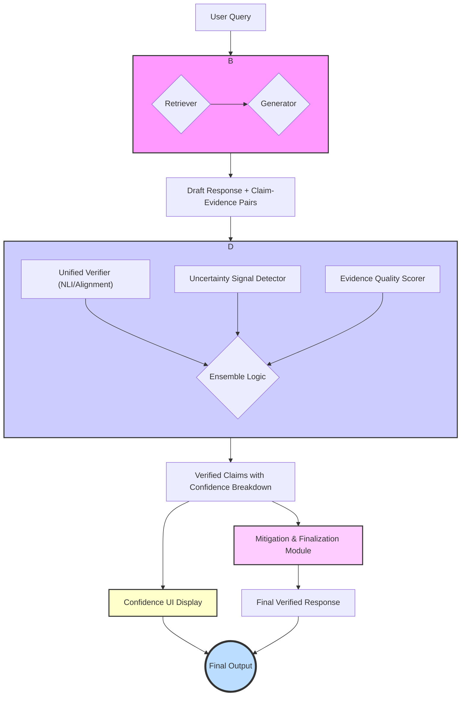

# System Architecture: Integrating a Confidence UI

This document outlines a redesigned architecture that integrates a transparent Confidence UI. The design is updated to calculate and expose structured confidence signals, which drive both the UI and the mitigation strategies.

## High-Level Pipeline Flowchart

This diagram illustrates the updated data flow, including the calculation of confidence signals and their visualization.

---

## Module-by-Module Design

### 1. Baseline RAG Module
*(This module's core function remains the same, but it now passes token-level metadata to the Verifier.)*

-   **Inputs:**
    -   `user_query`: (string) The input prompt from the user.
-   **Process:**
    1.  **Retrieve:** The hybrid retriever fetches relevant documents.
    2.  **Generate:** The generator LLM produces a draft response, while capturing token-level metadata (e.g., logits).
    3.  **Decompose & Pair:** The draft is decomposed into atomic claims, creating direct `(claim, evidence)` pairs.
-   **Outputs:**
    -   `draft_response`: (string) The full, unverified draft response.
    -   `claim_evidence_pairs`: (List[dict]) A list where each dictionary contains the `claim`, the `evidence` document, and `generator_metadata`.

### 2. Verifier Module (Confidence Signal Hub)

This module is redesigned to be the central hub for calculating all the sub-signals that constitute "confidence".

-   **Inputs:**
    -   `claim_evidence_pairs`: (List[dict]) The output from the Baseline RAG Module.

-   **Process & Sub-components:**
    1.  For each `(claim, evidence)` pair, the following sub-components run in parallel:
        -   **Unified Verifier (NLI/Alignment):** A model (or pair of models) that analyzes the claim against the evidence.
            -   **Output:** A probability distribution: `{p_supported, p_refuted, p_nei}`.
        -   **Uncertainty Signal Detector:** Analyzes the `generator_metadata`.
            -   **Output:** A `token_uncertainty` score (e.g., normalized mean entropy over the claim's tokens).
        -   **Evidence Quality Scorer:** A new component that assesses the retrieved evidence itself.
            -   **Process:** Calculates the fraction of the claim's key entities and numbers that appear in the evidence (`coverage`) and a penalty based on the evidence's rank (`rank_penalty`).
            -   **Output:** An `evidence_quality` dictionary: `{coverage, rank_penalty}`.
    2.  **Ensemble Logic:** This step does **not** compute a single status. Instead, it gathers all the calculated signals into a structured breakdown.

-   **Outputs:**
    -   `verified_claims`: (List[dict]) A list where each dictionary contains:
        -   `claim`: (string) The original atomic claim.
        -   `evidence`: (dict) The associated evidence.
        -   `confidence_breakdown`: (dict) A structured dictionary containing all signals:
            -   `p_supported`: (float)
            -   `p_refuted`: (float)
            -   `p_nei`: (float)
            -   `token_uncertainty`: (float)
            -   `evidence_quality`: (dict) `{coverage, rank_penalty}`

### 3. Mitigation & Finalization Module

This module uses the detailed confidence breakdown to apply more nuanced, rule-based corrections.

-   **Inputs:**
    -   `draft_response`: (string) The original draft.
    -   `verified_claims`: (List[dict]) The output from the Verifier Module.

-   **Process:**
    1.  The module iterates through the `verified_claims`.
    2.  It builds the final response by applying rules based on the `confidence_breakdown`:
        -   **If `p_supported` > 0.8 AND `p_refuted` < 0.1**: The claim is considered **Supported**. It is included in the final text with a citation.
        -   **If `p_refuted` > 0.7**: The claim is considered **Contradictory**. It is corrected based on the evidence or replaced with a warning statement.
        -   **Otherwise**: The claim is considered to have **Insufficient Info**. It is rephrased to reflect uncertainty (e.g., "It is suggested that Y...") or omitted if `p_nei` is very high.
    3.  The module assembles the final, coherent response with citations and a reference list.

-   **Outputs:**
    -   `final_response`: (string) The final, polished, and verified text.

### 4. Confidence UI Display

This new module is responsible for visualizing the confidence signals for the end-user in a transparent way.

-   **Inputs:**
    -   `verified_claims`: (List[dict]) The output from the Verifier Module.

-   **Process:**
    1.  For each claim in the final response, the UI provides an interactive element (e.g., an icon or highlighted text).
    2.  On hover or click, the UI displays a tooltip or a small pop-up that visualizes the `confidence_breakdown` without showing a single, opaque score.
    3.  **Visualization Example:**
        -   **Support:** A bar showing the `p_supported` probability (e.g., "85% Supported").
        -   **Evidence Quality:** A score or icon representing `coverage` and `rank_penalty`.
        -   **Model Confidence:** A meter showing `1 - token_uncertainty` (e.g., "High Model Confidence").
        -   **Warning:** If `p_refuted` is high, a prominent red flag or warning icon is displayed.

-   **Outputs:**
    -   An interactive user interface integrated with the `final_response` that allows users to inspect the reasoning and confidence behind each claim.
