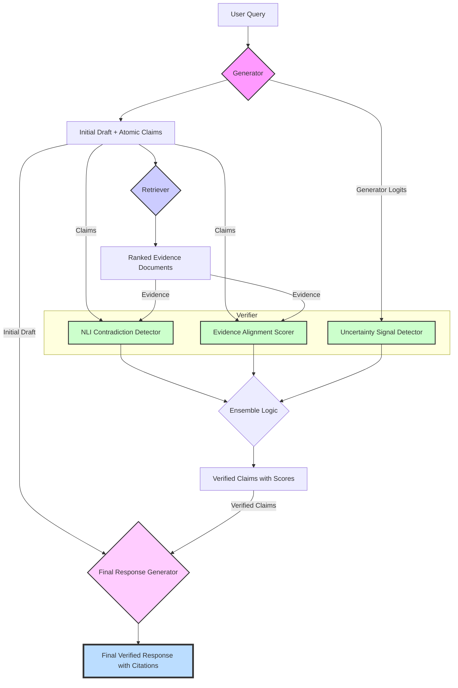

# System Architecture: Generator-Retriever-Verifier Pipeline

This document outlines the design for the hallucination detection and mitigation pipeline, as per the project plan. The system is composed of four main modules: the Generator, the Retriever, the Verifier, and the Final Response Generator.

## High-Level Pipeline Flowchart

This diagram illustrates the end-to-end flow of data, from the initial user query to the final, verified response.

---

## Module-by-Module Design

### 1. Generator Module

This module is responsible for creating the initial response and breaking it down into verifiable units.

-   **Inputs:**
    -   `user_query`: (string) The input prompt from the user.

-   **Process:**
    1.  The generator LLM (a fine-tuned model like Llama2) produces an initial, comprehensive draft response to the `user_query`.
    2.  The draft is then processed to decompose it into a list of "atomic claims." Each claim is a simple, declarative statement that can be independently verified (e.g., "The Eiffel Tower was completed in 1889.").
    3.  The module also captures token-level metadata from the generation process (e.g., logits, entropy) for the uncertainty analysis.

-   **Outputs:**
    -   `initial_draft`: (string) The full, unverified draft response.
    -   `atomic_claims`: (List[string]) A list of individual claims extracted from the draft.
    -   `generator_metadata`: (dict) A dictionary containing token-level probabilities and other data for uncertainty calculation.

### 2. Retriever Module

This module fetches relevant evidence from a knowledge base to support or refute the atomic claims.

-   **Inputs:**
    -   `atomic_claims`: (List[string]) The list of claims from the Generator.

-   **Process:**
    1.  For each claim in the input list, the module executes a hybrid retrieval strategy.
    2.  **Sparse Retrieval (BM25):** A fast, keyword-based search to find documents with high term overlap.
    3.  **Dense Retrieval (e.g., Contriever/FAISS):** A semantic search to find documents that are contextually similar to the claim.
    4.  The results from both retrievers are combined and passed to a simple reranker to produce a final, ordered list of the most relevant evidence chunks.

-   **Outputs:**
    -   `ranked_evidence`: (Dict[string, List[dict]]) A dictionary where each key is an atomic claim, and the value is a sorted list of evidence documents. Each evidence document is a dictionary containing:
        -   `content`: (string) The text of the evidence chunk.
        -   `source_id`: (string) The unique identifier for the source document (e.g., Wikipedia page ID).
        -   `span`: (string) The specific location of the chunk within the source document for precise citation.
        -   `retrieval_score`: (float) The final relevance score from the reranker.

### 3. Verifier Module (Ensemble)

This is the core module that assesses the factuality of each claim. It combines signals from three sub-components.

-   **Inputs:**
    -   `atomic_claims`: (List[string])
    -   `ranked_evidence`: (Dict[string, List[dict]])
    -   `generator_metadata`: (dict)

-   **Process & Outputs (Sub-modules):**

    1.  **NLI Contradiction Detector:**
        -   **Process:** For each claim, a fine-tuned Natural Language Inference model (e.g., DeBERTa) compares the claim against the content of the top-ranked evidence document.
        -   **Output:** A probability distribution over three labels: `{"entailment": float, "neutral": float, "contradiction": float}`.

    2.  **Evidence Alignment Scorer:**
        -   **Process:** A trained classification model evaluates the claim-evidence pair to determine how well the evidence supports the claim, drawing from the methodology of FEVER.
        -   **Output:** A probability distribution over three labels: `{"supported": float, "refuted": float, "not_enough_info": float}`.

    3.  **Uncertainty Signal Detector:**
        -   **Process:** This module analyzes the `generator_metadata`. It calculates the normalized token entropy for the sequence of tokens that make up the claim. It also uses the self-consistency method from SelfCheckGPT by generating multiple drafts to see how much the claim varies.
        -   **Output:** A single `uncertainty_score` (float) between 0 and 1, where a higher score indicates higher uncertainty or lower confidence.

-   **Process (Ensemble Logic):**
    1.  For each claim, the outputs from the three sub-modules are collected.
    2.  A weighted heuristic or a trained meta-classifier combines these signals into a final verification status. For example:
        -   If NLI `contradiction` > 0.8 OR Alignment `refuted` > 0.8 -> **Status: Contradictory**
        -   If NLI `entailment` > 0.7 AND Alignment `supported` > 0.7 AND `uncertainty_score` < 0.3 -> **Status: Supported**
        -   Otherwise -> **Status: Insufficient_Info**

-   **Final Output of Verifier Module:**
    -   `verified_claims`: (Dict[string, dict]) A dictionary where each key is an atomic claim, and the value is a dictionary containing:
        -   `status`: (string) The final verification label: "Supported", "Contradictory", or "Insufficient_Info".
        -   `best_evidence`: (dict) The evidence document that was used for the final judgment.

### 4. Final Response Generator & Mitigation Module

This module constructs the final, trustworthy response for the user.

-   **Inputs:**
    -   `initial_draft`: (string) The original draft from the Generator.
    -   `verified_claims`: (Dict[string, dict]) The output from the Verifier.

-   **Process:**
    1.  The module iterates through the `initial_draft`, locating each atomic claim.
    2.  It applies a set of rules based on the verification status of each claim:
        -   If a claim's status is **"Supported"**: The claim is kept in the text, and a citation is appended, pointing to the `best_evidence` (e.g., "[1]"). A corresponding entry is added to a reference list at the end of the response.
        -   If a claim's status is **"Contradictory"**: The claim is rewritten or removed. For example, it could be replaced with a corrected fact from the evidence or a statement like, "The initial claim about X was found to be incorrect."
        -   If a claim's status is **"Insufficient_Info"**: The claim is rephrased to indicate uncertainty, and a warning is added. For example, "While it is suggested that Y, this could not be fully verified with the available information."
    3.  The module assembles the modified text into a final, coherent response, complete with inline citations and a formatted reference list.

-   **Outputs:**
    -   `final_response`: (string) The final, polished, and verified text presented to the user, including citations and a reference list.
