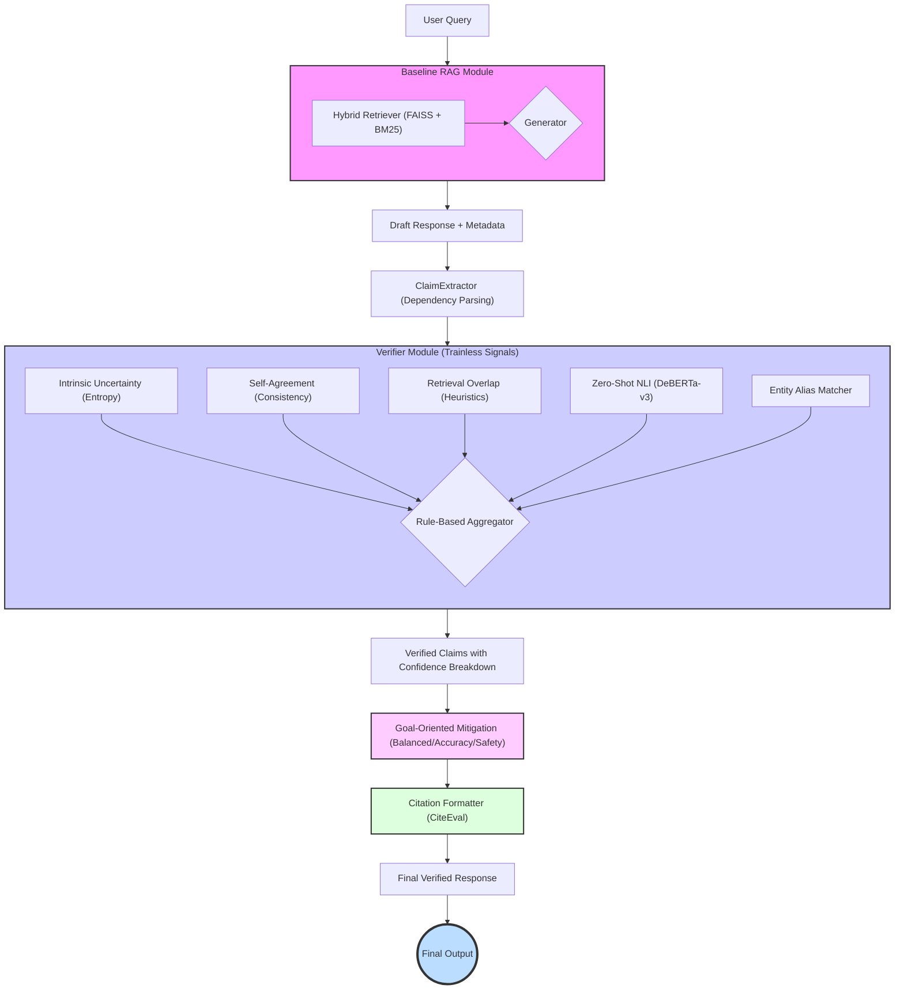

# System Architecture: Trainless Verifier & Simplified UI

This document outlines a redesigned architecture focused on a **trainless, multi-signal verifier** for hallucination detection. The design prioritizes modular, zero-shot techniques and defers complex training and UI elements.

## High-Level Pipeline Flowchart

This diagram illustrates the updated data flow, emphasizing the hybrid retrieval foundation, the parallel verifier signals, the citation post-processor, and the goal-oriented mitigation components.


```mermaid
graph TD
    A[User Query] --> B;
    subgraph B[Baseline RAG Module]
        direction LR
        B1["Hybrid Retriever (FAISS + BM25)"] --> B2{Generator};
    end
    B --> C["Draft Response + Metadata"];
    C --> C1["ClaimExtractor (Dependency Parsing)"];
    C1 --> D;
    subgraph D["Verifier Module (Trainless Signals)"]
        direction TB
        D1["Intrinsic Uncertainty (Entropy)"]
        D2["Self-Agreement (Consistency)"]
        D3["Retrieval Overlap (Heuristics)"]
        D4["Zero-Shot NLI (DeBERTa-v3)"]
        D5["Entity Alias Matcher"]
        D_Aggregator{"Rule-Based Aggregator"}
        D1 --> D_Aggregator;
        D2 --> D_Aggregator;
        D3 --> D_Aggregator;
        D4 --> D_Aggregator;
        D5 --> D_Aggregator;
    end
    D --> E["Verified Claims with Confidence Breakdown"];
    E --> F["Goal-Oriented Mitigation (Balanced/Accuracy/Safety)"];
    F --> F1["Citation Formatter (CiteEval)"];
    F1 --> H[Final Verified Response];
    H --> I((Final Output));

    style B fill:#f9f,stroke:#333,stroke-width:2px
    style D fill:#ccf,stroke:#333,stroke-width:2px
    style F fill:#fcf,stroke:#333,stroke-width:2px
    style F1 fill:#dfd,stroke:#333,stroke-width:2px
    style I fill:#bdf,stroke:#333,stroke-width:4px
```

---

## Module-by-Module Design

### 1. Baseline RAG Module
*(Fulfills standard RAG duties while remaining verifier-aware by capturing structural and probabilistic metadata.)*

-   **Knowledge Base Prep (Wikipedia):**
    -   **Custom Parsing:** `WikipediaParser` cleans XML dumps (removing redirects and wikitext).
    -   **Semantic Chunking:** Uses spaCy's sentencizer to fragment text into atomic units.
    -   **Hybrid Indexing:** Pairs **FAISS** (Dense/Semantic) with **BM25Okapi** (Sparse/Lexical) for robust recall.

-   **Process:**
    1.  **Hybrid Retrieve:** Executes parallel search across dense and sparse indices, fused via **Reciprocal Rank Fusion (RRF)**.
    2.  **Metadata-Aware Generate:** Produces a response using `GeneratorWrapper` while intercepting **Token Logits** and **Entropy**.
    3.  **Claim Extraction:** Uses `ClaimExtractor` (spaCy dependency parsing) to fragment the unified response into atomic, verifiable `Claim` objects.
-   **Outputs:**
    -   `draft_response`: (string) The full, unverified response.
    -   `claim_evidence_pairs`: (List[dict]) Associates each `Claim` with its top-k `EvidenceChunk` candidates and generator metadata.

### 2. Verifier Module (Trainless Signal Hub)

The Verifier Module aggregates a diverse ensemble of zero-shot signals to classify every claim.

-   **Parallel Signal Detectors:**
    1.  **Intrinsic Uncertainty:** Measures internal confidence via **Shannon Entropy** ($H = -\sum p \log p$) over the token vocabulary during generation (SelfCheckGPT-style).
    2.  **Self-Agreement:** Generates $N$ stochastic samples at high temperature to verify if the model converges on the same factual claim (Majority Vote).
    3.  **Retrieval Overlap (Heuristics):** Calculates **Entity & Number Coverage** (lexical anchors) and **ROUGE-L** overlap between claim and evidence.
    4.  **Zero-Shot NLI:** A **DeBERTa-v3 LARGE** cross-encoder classifies the logical status (Entailment/Contradiction/Neutral) between source context and claim.
    5.  **Entity Alias Matcher:** Resolves surface-level name variations (e.g., "US" vs "United States") via fuzzy matching to prevent false-negative grounding checks.

-   **Rule-Based Aggregator:**
    -   Implements **Veto Logic** (e.g., NLI Contradiction overrides high lexical overlap).
    -   Computes a finalized **Verdict** (Supported, Contradictory, or Low Confidence) based on weighted normalization.

-   **Outputs:**
    -   `verified_claims`: (List[dict]) A list where each dictionary contains:
        -   `claim`: (string) The original atomic claim.
        -   `evidence`: (dict) The associated evidence.
        -   `confidence_breakdown`: (dict) A structured dictionary containing all raw signals (e.g., `entropy_score`, `nli_results`, `coverage_score`).
        -   `final_verdict`: (string) A final verdict (e.g., "Supported", "Contradictory", "Low Confidence") derived from the rule-based aggregator.

### 3. Mitigation Module (Goal-Oriented Correction)

This module applies rule-based corrective policies based on verifier feedback without retraining the generator.

-   **Goal-Oriented Routing:**
    -   **Balanced Mode:** Equalizes precision/retention for general-purpose use.
    -   **Accuracy-Focused (RAGTruth-style):** High sensitivity to contradictions.
    -   **Attribution-Safety (Citation-style):** Prioritizes exact citation grounding.
-   **Mitigation Policies:**
    1.  **Filtering:** Programmatically excising contradictory claims using reverse-order span deletion.
    2.  **Evidence Re-Ranking:** Repositions evidence chunks based on backward-flowing verification scores ($Score_{final} = \alpha \times Score_{retr} + \beta \times Score_{verif}$).
    3.  **Generator Re-Prompting:** Feeds the logic critique back to the LLM context (e.g., via **Chain-of-Verification**) to rewrite the answer.

### 4. Hybrid UI Layer

Transparently exposes the system's reasoning via two specialized interfaces.

-   **Interfaces:**
    1.  **Confidence UI:** A simple view for standard users showing final verdicts, colored claim spans, and basic signal badges.
    2.  **Controlled UI:** An advanced debugging environment allowing per-signal drill-downs (log probabilities, detailed NLI breakdowns, and raw entity matches).
-   **Signal Bucketing:** Normalizes high-dimensional telemetry into qualitative "High/Medium/Low" buckets for readability.

---

## Post-Processing & Evaluation Infrastructure

### 5. Citation Formatter Module
The system converts verified responses into human-readable, grounded text through a specialized mapping layer.

-   **Process:**
    1.  **Index Mapping:** Ranks the $k$ evidence chunks for each claim.
    2.  **Span Injection:** Injects bracketed citations `[i]` into the answer text according to character-level span boundaries.
    3.  **CiteEval Adapting:** Formats the final answer into the `CiteEvalSystemExample` structure (id, query, passages, pred) for third-party evaluation.

### 6. Evaluation Framework
Built-in modules measure the pipeline's effectiveness against known benchmarks.

-   **Modules:**
    -   **RAGTruth Evaluator:** Computes hallucination detection accuracy on the RAGTruth dataset.
    -   **Composite Scorer:** Combines precision, recall, and NLI entailment scores into an overall performance index.
    -   **Ablation Support:** Facility to disable individual verifier detectors to measure their relative contribution.

---
*Interface for Future Training:* The `Verifier Module` is designed to be extensible. Each trainless signal component can be replaced by a trained model in the future. The `Rule-Based Aggregator` can be swapped with a trainable `Ensemble Fusion Logic` that learns to weigh the signals optimally, without changing the overall architecture.

---

## Data Structures (IO Payloads)

The following JSON-like structures define the key data objects passed between the modules in the pipeline.

### Query
Represents the initial input from the user.
```json
{
  "id": "q_20250201_001",
  "text": "Who founded the FEVER dataset project?",
  "timestamp": "2025-02-01T10:10:10Z"
}
```

### EvidenceChunk
A single piece of text retrieved from the knowledge corpus.
```json
{
  "doc_id": "enwiki_12345",
  "sent_id": 17,
  "text": "The FEVER dataset was introduced in 2018 by...",
  "char_start": 210,
  "char_end": 265,
  "score_bm25": 7.43,
  "score_dense": 0.62,
  "score_hybrid": 0.69,
  "rank": 3,
  "source": "wikipedia",
  "version": "wiki_sent_v1"
}
```

### Claim
An atomic, verifiable statement extracted from the LLM's draft response.
```json
{
  "claim_id": "c_0007",
  "answer_id": "ans_001",
  "text": "The FEVER dataset was introduced in 2018.",
  "answer_char_span": [134, 175],
  "extraction_method": "rule_sentence_split_v1"
}
```

### ClaimEvidencePair
Associates a claim with its corresponding retrieved evidence.
```json
{
  "claim_id": "c_0007",
  "evidence_candidates": ["enwiki_12345#17","enwiki_77889#04"],
  "top_evidence": "enwiki_12345#17",
  "generator_metadata": {
    "tokens": ["The", "FE", "VER", " dataset", "..."],
    "token_entropies": [0.12, 0.45, 0.23],
    "probs": [0.99, 0.88, 0.95]
  }
}
```

### CitationFormatterOutput
Result of post-processing a generated answer to add inline bracketed citations and to prepare passages for external evaluators (e.g., CiteEval/CiteBench). This does not alter retrieval or verifier logic.
```json
{
  "formatted_text": "The FEVER dataset was introduced in 2018. [1]",
  "citation_map": {
    "c_0007": [1]
  },
  "passages": [
    {"text": "The FEVER dataset was introduced in 2018 by...", "title": "FEVER"},
    {"text": "FEVER is a benchmark for fact verification.", "title": "FEVER"}
  ],
  "notes": {
    "merged_redundant": true,
    "method": "right_span_insertion_v1"
  }
}
```
Fields:
- `formatted_text`: Answer with inline citations using 1-based indices `[i]` that refer to `passages[i-1]`.
- `citation_map`: Mapping from `claim_id` to the list of passage indices used inside that claim’s span.
- `passages`: Ordered list derived from ranked evidence chunks; each item contains at least `text`, and optionally `title` if available from metadata.
- `notes` (optional): Diagnostics such as merges, drops, or formatter strategy used.

### CiteEvalSystemExample
Adapter object for CiteEval “System Evaluation”. Produced from `CitationFormatterOutput` without changing core architecture.
```json
{
  "id": "ex_0001",
  "query": "Who introduced the FEVER dataset?",
  "passages": [
    {"text": "The FEVER dataset was introduced in 2018 by...", "title": "FEVER"},
    {"text": "FEVER is a benchmark for fact verification.", "title": "FEVER"}
  ],
  "pred": "The FEVER dataset was introduced in 2018. [1]"
}
```
Notes:
- Indices in `pred` are 1-based and must align with the order of `passages`.
- This object enables CiteEval “Full” (citations optional) and “Cited” (citations required) modes.

### VerifierSignal
The raw output of a single detector signal for a given claim-evidence pair.
```json
{
  "claim_id": "c_0007",
  "doc_id": "enwiki_12345",
  "sent_id": 17,
  "nli": {"entail": 0.81, "contradict": 0.03, "neutral": 0.16},
  "coverage": {"entities": 0.83, "numbers": 1.0, "tokens_overlap": 0.74},
  "uncertainty": {"mean_entropy": 1.12},
  "consistency": {"variance": null},
  "citation_span_match": 0.9,
  "numeric_check": true
}
```

### ClaimDecision
The final, aggregated verdict for a single claim after all verifier signals have been processed.
```json
{
  "claim_id": "c_0007",
  "status": "Supported",
  "rationale": "High entail prob, good entity coverage",
  "primary_evidence": "enwiki_12345#17",
  "signals_ref": ["sig_c_0007_17"],
  "confidence": {
    "support_prob": 0.81,
    "contradict_prob": 0.03,
    "overall_confidence": 0.74,
    "band": "High"
  }
}
```

### AnnotatedAnswer
The final output object, containing the full answer annotated with decisions for each claim.
```json
{
  "answer_id": "ans_001",
  "query_id": "q_20250201_001",
  "raw_answer": "…",
  "claims": "[ClaimDecision, ...]",
  "summary_stats": {
    "claims_total": 9,
    "supported_high": 5,
    "supported_low": 1,
    "contradicted": 1,
    "insufficient": 2,
    "mean_overall_confidence": 0.61
  },
  "mitigation_actions": ["removed_contradicted_claims"],
  "version": "pipeline_v0.3"
}
```

### MitigationOutput
The result of the mitigation process, detailing what actions were taken to improve the response.
```json
{
  "original_answer_id": "ans_001",
  "final_text": "The FEVER dataset was introduced in 2018. [1] [Warning: Claim about 2019 removed]",
  "actions_taken": [
    {
      "type": "filter",
      "target_claim_id": "c_0008",
      "reason": "Contradictory verdict"
    },
    {
      "type": "re-rank",
      "details": "Promoted evidence enwiki_12345#17 to rank 1"
    }
  ],
  "requires_regeneration": false
}
```
