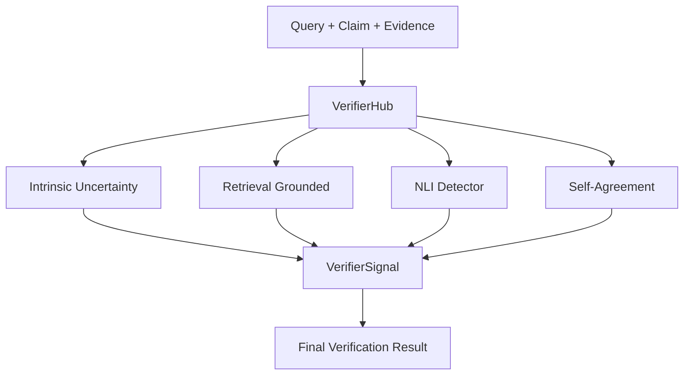

# Month 4 Verifier Module (Part 2) - Documentation

**Version:** 1.0  
**Date:** December 2025  
**Status:** ✅ Completed (Tasks 1-5)

---

## Table of Contents

1. [Overview](#overview)
2. [Theoretical Background](#theoretical-background)
3. [Architecture](#architecture)
4. [Implementation Details](#implementation-details)
5. [Configuration Guide](#configuration-guide)
6. [Testing & Validation](#testing--validation)
7. [Month 5 Preview](#month-5-preview)

---

## Overview

### Month 4 Goals

Month 4 focuses on **Model-Based Hallucination Detection**, expanding the verification pipeline with advanced semantic analysis capabilities. While Month 3 relied on trainless heuristics (entropy, entity coverage), Month 4 introduces neural approaches to capture deeper semantic inconsistencies:

1.  **Natural Language Inference (NLI)**: Determining if the evidence logically entails or contradicts the claim.
2.  **Self-Agreement (Self-Consistency)**: Measuring if the model generates consistent answers when sampled stochastically multiple times.
3.  **Multi-Evidence Aggregation**: Robustly handling multiple retrieved evidence chunks.

### Achievements

✅ **Tasks Completed (5/5)**

| Task | Description | Status | Key Components |
|------|-------------|--------|----------------|
| 1 | VerifierHub Architecture | ✅ | Central Orchestrator |
| 2 | Multi-Evidence Verification | ✅ | Max/Mean Aggregation |
| 3 | NLI Detector | ✅ | DeBERTa-v3-base |
| 4 | Self-Agreement Detector | ✅ | Stochastic Sampling + Semantic Similarity |
| 5 | Full Integration & Testing | ✅ | Comprehensive Test Suite |

**Overall Metrics:**
-   **Total Tests**: 190 (100% pass rate)
    -   Unit Tests: 168
    -   Integration Tests: 22 (10 Part 1 + 12 Part 2)
-   **New Code Coverage**: High coverage for NLI and Self-Agreement modules
-   **Performance**: Optimized batch processing for NLI

---

## Theoretical Background

### 1. Natural Language Inference (NLI)

NLI (or Recognizing Textual Entailment) classifies the relationship between a **Premise** (Evidence) and a **Hypothesis** (Claim) into three categories:

-   **Entailment**: The claim is logically supported by the evidence.
-   **Contradiction**: The claim logically contradicts the evidence.
-   **Neutral**: The claim is unrelated to the evidence.

**Model Used**: `MoritzLaurer/DeBERTa-v3-base-mnli-fever-anli`
-   Trained on MultiNLI, FEVER, and ANLI datasets.
-   Robust for fact-checking tasks.

### 2. Self-Agreement (Self-Consistency)

Based on the intuition that **hallucinations are often stochastic**, while factual knowledge is consistent. If we ask the model the same question multiple times (with high temperature), factual answers should remain semantically similar, while hallucinated answers may vary wildly.

**Methodology**:
1.  **Sampling**: Generate $k$ additional responses ($S_1, ..., S_k$) for the same query using a higher temperature (e.g., $T=1.5$).
2.  **Embedding**: Encode the original response $R$ and all samples $S_i$ into semantic vectors.
3.  **Consistency Score**: Calculate the average cosine similarity between $R$ and all $S_i$.

$$ \text{Consistency}(R) = \frac{1}{k} \sum_{i=1}^{k} \text{CosineSim}(\text{Embed}(R), \text{Embed}(S_i)) $$

**Model Used**: `sentence-transformers/all-MiniLM-L6-v2` (Efficient 384-d embeddings).

---

## Architecture

### VerifierHub

The `VerifierHub` acts as the central controller, orchestrating all four detectors:



### Multi-Evidence Strategy

When multiple evidence chunks are retrieved, the system must aggregate signals. We support configurable aggregation strategies:

-   **Max (Optimistic)**: Takes the highest score (e.g., if *any* chunk supports the claim, it's supported).
-   **Mean (Balanced)**: Averages scores across all chunks.
-   **Min (Pessimistic)**: Takes the lowest score.

---

## Implementation Details

### 1. NLIDetector (`src/verification/nli_detector.py`)
-   **Input**: Claim string, Evidence string (or list).
-   **Output**: Probabilities for `[entailment, neutral, contradiction]`.
-   **Optimization**: Uses batch processing for multi-chunk evidence to maximize GPU utilization.

### 2. SelfAgreementDetector (`src/verification/self_agreement.py`)
-   **Input**: Original Query, Original Response, Generator function.
-   **Process**:
    -   Triggers generator $k$ times.
    -   Computes semantic similarity matrix.
-   **Fallback**: Gracefully handles cases where the generator is unavailable.

### 3. VerifierHub (`src/verification/verifier_hub.py`)
-   **Unified Interface**: `verify_claim(claim, evidence, metadata)`
-   **Signal Object**: Returns a structured `VerifierSignal` containing:
    -   `intrinsic_uncertainty`: {entropy, perplexity}
    -   `groundedness`: {entity_coverage, token_overlap}
    -   `nli`: {entailment, contradiction_score}
    -   `consistency`: {variance, self_agreement_score}

---

## Configuration Guide

The system is fully configurable via `config.yaml`:

```yaml
verification:
  enabled: true
  verify_all_evidence: true
  aggregation_method: "mean"  # "max", "mean", "min"

  # Month 4: NLI Settings
  nli:
    model_name: "MoritzLaurer/DeBERTa-v3-base-mnli-fever-anli"
    batch_size: 16
    device: "cuda"

  # Month 4: Self-Agreement Settings
  self_agreement:
    model_name: "sentence-transformers/all-MiniLM-L6-v2"
    k_samples: 5
    temperature: 1.5
    aggregation_method: "inherit" # Inherit global or override
```

---

## Testing & Validation

We implemented a comprehensive test suite ensuring robustness and backward compatibility.

### Integration Tests (`tests/integration/`)

1.  **`test_verifier_integration_p1.py` (Month 3 Scope)**
    -   Validates Intrinsic and Grounded detectors.
    -   Ensures basic pipeline functionality.

2.  **`test_verifier_integration_p2.py` (Month 4 Scope)**
    -   **Full Pipeline**: Tests all 4 detectors working together.
    -   **Multi-Evidence**: Verifies aggregation logic.
    -   **Self-Agreement**: Validates stochastic sampling and consistency computation.
    -   **Backward Compatibility**: Ensures system works even if optional components (like Generator) are missing.

### Results
-   **12/12** Month 4 Integration Tests Passed.
-   **10/10** Month 3 Integration Tests Passed.
-   **168** Unit Tests Passed.

---

## Month 5 Preview

With the Verifier Module complete, Month 5 will focus on:

1.  **Evaluation Framework**: Benchmarking the system against standard datasets (e.g., TruthfulQA, HaluEval).
2.  **Mitigation Strategies**: Using verification signals to trigger corrective actions (e.g., re-ranking, query refinement).
