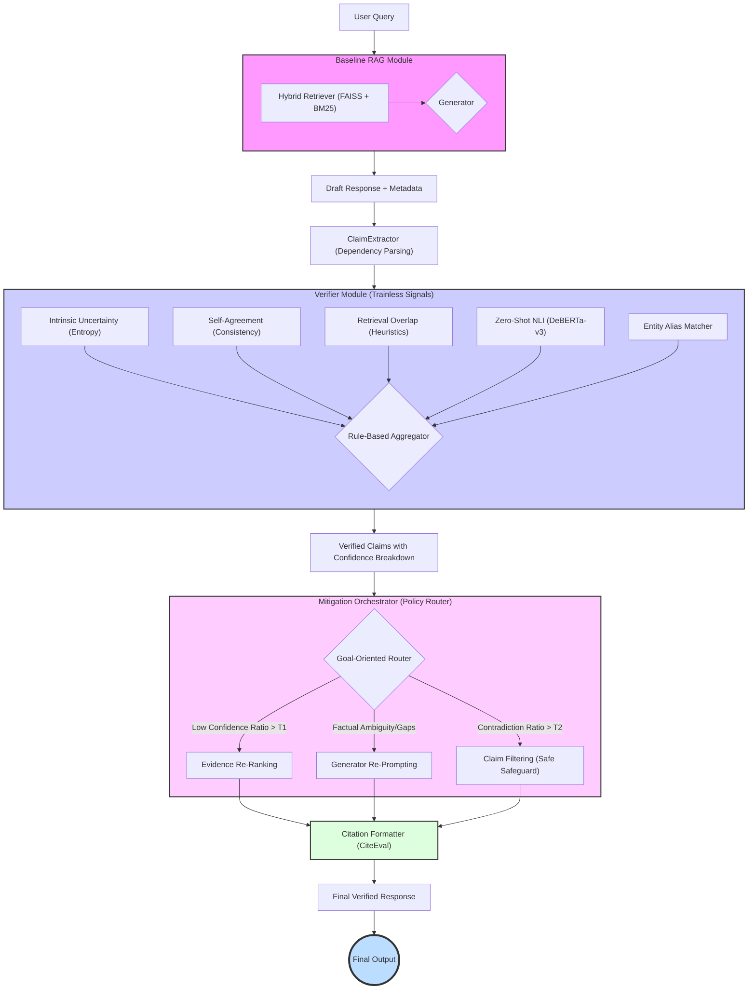

# Final Technical Report

**Date:** April 1, 2026
**Project:** Hallucination Detection & Mitigation for LLMs
**Author:** Technical Lead (Member 2)

---

## 1. System Design

Our project aims to address the critical issue of factual hallucinations in Large Language Models (LLMs), particularly within Retrieval-Augmented Generation (RAG) frameworks [2]. Building on the progress from the first term, we have successfully developed a complete **four-stage end-to-end pipeline** that acts as a post-hoc safety layer, combining a **trainless verifier** with a proactive **mitigation module**. This research is grounded in the taxonomies and challenges identified in contemporary surveys on the phenomenon [1].



### Core Architecture: Generator-Retriever-Verifier-Mitigator
The system follows a structured pipeline designed to ensure that generating claims are grounded in retrieved evidence, verified for factuality, and automatically corrected if evidence proves contradictory:

1.  **Baseline RAG (Retrieval & Generation):** Fetches relevant documents from our knowledge base (Wikipedia) based on the user's query utilizing a **Hybrid Retriever**. The language model then generates a unified response while strictly capturing **token-level metadata** (logits/probabilities). 
2.  **Claim Extraction:** A decomposition utility breaks the generated response into atomic, independent claims, ensuring precise sentence-level processing.
3.  **Verification (Trainless Verifier):** The `VerifierHub` receives these claim-evidence pairs. This module evaluates each claim and assigns a multidimensional confidence score by aggregating several independent, zero-shot signals.
4.  **Mitigation:** Finally, the `MitigationOrchestrator` receives the verified claims and applies rule-based corrective actions—such as filtering unsupported claims, reprompting the generator, or reranking evidence—to construct a factually consistent final response.

### The Trainless Verifier and Mitigation Philosophy
Unlike approaches that require training massive, opaque "LLM-as-a-Judge" models [9], our verifier aggregates multiple zero-shot signals. This approach minimizes latency and maintains computational efficiency:

1.  **Intrinsic Uncertainty:** Measures the model's internal confidence using token-level statistics, specifically calculating **Shannon Entropy** ($H = -\sum p \log p$) over the vocabulary distribution. High entropy often strongly correlates with hallucination.
2.  **Retrieval-Grounded Heuristics:** Quantifies the overlap between the generated claim and the evidence, encompassing **Entity Coverage**, **Number Coverage**, and **Token Overlap** (ROUGE-L).
3.  **Zero-Shot NLI:** Uses an off-the-shelf Natural Language Inference model to classify the formal relationship (Entailment, Contradiction, Neutral) between a retrieved source document and an atomic claim.
4.  **Self-Agreement:** Validates factual consistency across multiple generated stochastic samples.

These signals converge into a **Rule-Based Aggregator** that issues a finalized verdict. The **Mitigation Module** then acts transparently on this verdict without retraining, relying on predetermined procedures (e.g., omitting contradicting sentences or replacing sections entirely) to "edit" the final answer.

---

## 2. Technical Methodology

### 2.1 Knowledge Base: The Wikipedia Corpus

Our system is designed to be knowledge-agnostic, supporting both static large-scale corpora and dynamic user-provided context. While our architecture natively supports **user-input context** as a temporary, high-relevance knowledge base (an optimization for specific workflows), we utilize a curated subset of the **English Wikipedia** (`enwiki-sample.xml`) as our primary, comprehensive knowledge base for general-purpose retrieval.

To ensure high-quality retrieval across these sources, we implemented a rigorous data ingestion pipeline:

*   **Parsing & Cleaning:** We developed a custom `WikipediaParser` to extract plain text from the XML dump, stripping out redirects, disambiguation pages, and complex wikitext elements (templates, HTML tags).
*   **Semantic Chunking:** The cleaned text is segmented using spaCy's sentencizer into atomic units (chunks). We apply a length filter to ensure each chunk contains enough semantic context for the retriever without overwhelming the generator's context window.
*   **Vector Embedding:** We utilize the `sentence-transformers/all-MiniLM-L6-v2` model to transform each text chunk into a 384-dimensional dense vector. This step captures the semantic essence of the information, allowing the system to match queries with evidence based on conceptual meaning rather than just shared keywords.
*   **Indexing:** To enable efficient retrieval over the large-scale Wikipedia corpus, we maintain two parallel indices:
    *   **Dense Index (FAISS):** The generated embeddings are stored in a **FAISS** `IndexFlatIP` (Inner Product) index. This enables high-speed, approximate nearest-neighbor searches in the latent vector space.
    *   **Sparse Index (BM25):** We construct a lexical index using the **BM25Okapi** algorithm. This involves pre-tokenizing the corpus and calculating the inverse document frequency (IDF) for all terms, ensuring high-precision retrieval for rare entities and exact keyword matches.

### 2.2 The RAG Module

The Baseline RAG Pipeline (`BaselineRAGPipeline`) is the critical starting point of our system. It is engineered to fulfill standard retrieval duties while remaining "verifier-aware" by storing state and detailed probabilistic metadata for downstream modules. 

#### A. Hybrid Retrieval Strategy

The **Hybrid Retrieval Strategy** is responsible for grounding the generation process in high-quality, relevant evidence by bridging the "lexical gap" between user queries and the knowledge base. Its primary role is to retrieve the most pertinent evidence documents from our Wikipedia corpus or user-provided context, serving as the critical bridge between the raw knowledge source and the generator LLM. Ensure that the information provided to the model is both semantically relevant and lexically precise. Correct retrieval at this stage directly correlates with higher verification scores in downstream modules.

Our foundation relies on the synthesis of dense semantic matching and sparse lexical keyword search to minimize the "lexical gap" identified in the first term.

*   **Dense Semantic Search (FAISS):** We continue to use high-dimensional Sentence-Transformers encoding into an `IndexFlatIP`. This guarantees excellent recall for conceptual and synonymous relationships.
*   **Sparse Lexical Search (BM25):** We incorporated `BM25Okapi` indexing integrated within our `BM25Retriever`. The BM25 index targets specific noun phrases and rare acronyms that dense embeddings frequently obscure.

**Retrieval Data Flow and Fusion:**
We execute parallel searches across both indexes. To standardize the output, we calculate the combination of scores utilizing **Linear Scoring** or **Reciprocal Rank Fusion (RRF)**:
$$ S_{RRF} = \frac{1}{k + \text{rank}_{dense}} + \frac{1}{k + \text{rank}_{BM25}} $$
The top-$k$ returned segments are securely passed to the generator.

**Code Example (`src/retrieval/hybrid_retriever.py`):**
```python
def retrieve(self, query: str, top_k: int = 5) -> List[EvidenceChunk]:
    # Parallel retrieval execution
    dense_results = self.dense_retriever.retrieve(query, top_k)
    bm25_results = self.bm25_retriever.retrieve(query, top_k)
    
    # Score normalization and Reciprocal Rank Fusion
    dense_norm = self._normalize_scores(dense_results, 'score_dense')
    bm25_norm = self._normalize_scores(bm25_results, 'score_bm25')
    
    # Merge, rerank, and select top_k documents
    fused_results = self._apply_rrf(dense_norm, bm25_norm)
    return fused_results[:top_k]
```

#### B. Generation with Metadata Harvesting

The **Generation Module** is responsible for synthesizing a coherent, context-aware preliminary response based on the query and the evidence retrieved in the previous stage. Beyond narrative construction, its secondary—and equally critical—responsibility is to act as a **telemetry source** for the Verifier. By exposing the LLM's internal probabilistic state (logits) during the decoding process, it provides the "intrinsic" signals needed to distinguish between a confident factual statement and a low-confidence "stochastic guess." This module ensures that the subsequent verification stages have access to the model's internal uncertainty, which is a key predictor of potential hallucination [3].

Our custom wrapper (`GeneratorWrapper`) implements metadata harvesting during sequence decoding. 

*   **Logit Extraction:** By forcing `output_scores=True` inside standard `generate` calls, we intercept the unnormalized output logs (logits) iteratively. 
*   **Token Probabilities:** Our generator maintains exact indices and maps raw text characters to internal SubWord tokens, securing accurate references for verification algorithms. 

**Code Example (`src/generation/generator_wrapper.py`):**
```python
def generate_with_metadata(self, prompt: str, evidence_chunks: List) -> Dict:
    inputs = self.tokenizer(prompt, return_tensors='pt', truncation=True)
    
    # Collect generation and store logits to trace internal uncertainty
    outputs = self.model.generate(
        **inputs,
        output_scores=True,
        return_dict_in_generate=True,
        max_new_tokens=150
    )
    
    # Extract rich metadata for the verifier
    return {
        'text': self.tokenizer.decode(outputs.sequences[0], skip_special_tokens=True),
        'tokens': self._get_token_list(outputs.sequences[0]),
        'logits': outputs.scores,
        'token_entropies': self._calculate_entropies(outputs.scores),
        'probs': self._calculate_probs(outputs.scores)
    }
```

### 2.3. Atomic Claim Extraction

The **Claim Extraction** module is responsible for the critical transition from unstructured, multi-sentence LLM responses to a structured set of verifiable propositions. Recognizing that verifying an entire paragraph at once is inherently noisy and prone to "averaging out" factual errors, this module fragments the raw output into atomic `Claim` objects. Its primary responsibility is to ensure that each claim is independent, grammatically complete, and accurately mapped to its original character sub-span in the generator's output. This granularity is what enables our system to provide the precise, sentence-level confidence highlights seen in the final UI.

Post-generation, the system employs **spaCy Dependency Parsing** and sentence boundary detection to intelligently fragment raw LLM text outputs. Every sentence boundary is split, and compound clauses (e.g., those joined by "however" or "while") are optionally decomposed to ensure maximum atomicity. These claims are then joined with the full array of retrieved $k$ instances to assemble `ClaimEvidencePair` objects.

**Code Example (`src/generation/claim_extractor.py`):**
```python
def extract_claims_spacy(text: str, answer_id: str = None) -> List[Claim]:
    # 1. Load spaCy model for precise sentence boundary detection
    nlp = get_spacy_model("en_core_web_sm")
    doc = nlp(text)
    
    # 2. Extract sentences and map to absolute character spans
    claims = []
    for sent in doc.sents:
        # Generate a unique ID and store character-level indices
        claim = Claim(
            claim_id=str(uuid.uuid4()),
            text=sent.text.strip(),
            answer_char_span=(sent.start_char, sent.end_char),
            extraction_method="spacy_sent_v1"
        )
        claims.append(claim)
    return claims
```

---

### 2.4. The Trainless Verifier Module

The Verifier Module is the core innovation of our project. It fundamentally shifts away from computationally expensive, black-box "LLM-as-a-Judge" frameworks [9] towards a rigorous, transparent ensemble of zero-shot signals. By inspecting both the model's internal statistical confidence and the external linguistic overlap, the `VerifierHub` issues a highly contextualized verdict.

#### 2.4.1 Core Data Structure: Claim-Evidence Pair
The verifier operates strictly on atomic `ClaimEvidencePair` objects. This ensures sentence-level precision rather than paragraph-level ambiguity.
*   **Input:** `ClaimEvidencePair(claim: Claim, evidence_candidates: List[EvidenceChunk], generator_metadata: dict)`
*   **Output:** `VerifiedClaim` (includes confidence scores of the 4 independent signals and a final categorical verdict: Supported, Contradictory, or Low Confidence).

#### 2.4.2 Intrinsic Uncertainty Detector

**Core Idea & Inspiration:**  
This detector is inspired by the **SelfCheckGPT** framework [3], which posits that LLMs behave like "stochastic parrots" when they lack factual knowledge. The core hypothesis is that factual hallucinations are not random errors but are preceded by high internal model uncertainty. When a model "knows" a fact, it allocates nearly all probability mass to a single, correct token. Conversely, when fabricating information, the probability distribution becomes "flat" or "entropic" as the model essentially guesses between multiple plausible-sounding but incorrect tokens. By measuring this "intrinsic" signal, we can detect hallucinations even without external evidence.

*   **Technical Highlights:**
    *   **Sub-word Token Mapping:** Accurately aligning character-level claims to LLM tokens (e.g., Llama's SentencePiece) requires handling prefix spaces and special control tokens.
    *   **Logit Stability:** We utilize **Log-Sum-Exp** normalization to prevent numerical overflow when processing raw model outputs.
    *   **Shannon Entropy ($H$):** A robust measure from Information Theory; $H=0$ implies total certainty, while higher values indicate "flat" distributions typical of guessing.

*   **Input:** Extracted `Claim` object and the `generator_metadata` (containing token-level logits).
*   **Method:** Utilizing **Log-Sum-Exp** for numerical stability, the system maps the claim's character span back to the original **Sub-word Tokens**. It then calculates the mean **Shannon Entropy** ($H$) over the probability distribution of the tokens:
    $$ H(x) = - \sum p(x) \log p(x) $$
*   **Output:** A scalar entropy score `{'mean_entropy': float}`. High mean entropy strongly correlates with fabricated facts.

**Code Example (`src/verification/intrinsic_uncertainty.py`):**
```python
def _calculate_entropy(self, logits: np.ndarray) -> float:
    # Applying Softmax with log-sum-exp stability
    max_logit = np.max(logits)
    exp_logits = np.exp(logits - max_logit)
    probs = exp_logits / np.sum(exp_logits)
    
    # Calculate Shannon Entropy
    entropy = -np.sum(probs * np.log(probs + self.epsilon))
    return float(entropy)
```

#### 2.4.3 Retrieval-Grounded Heuristics

**Core Idea & Inspiration:**  
Drawing inspiration from traditional fact-checking benchmarks like **FEVER** [4], this module operates on the principle of **lexical grounding**. The idea is that for a claim to be considered "faithful" to its source, it must preserve the core "anchors" of the evidence—specifically named entities and numeric values. Hallucinations often involve "entity-swapping" (mixing up names) or "numeric drift" (incorrect dates or quantities). By strictly enforcing coverage of these anchors, we provide a fast, interpretable heuristic that catches the most common types of RAG hallucinations before invoking more latent, compute-heavy semantic checks.

*   **Technical Highlights:**
    *   **NER Fuzzy Matching:** Since surface forms can vary (e.g., "U.S." vs "United States"), we use a small Levenshtein distance threshold for matching.
    *   **Anchor Point Analysis:** Numbers and Proper Nouns are treated as "Anchors"—non-negotiable factual units that must intersect with source text for a claim to be considered faithful.
    *   **ROUGE-L (Longest Common Subsequence):** Unlike simple n-gram overlap, ROUGE-L accounts for sentence structure by measuring the longest sequence of words appearing in both claim and evidence in the same relative order.

*   **Input:** `Claim` text and `EvidenceChunk` object (retrieved document snippet).
*   **Method:**
    *   **Anchor Point Analysis (Entity/Number):** Uses **spaCy NER** and rule-based extractors to identify anchor points. Validates their presence in the evidence via **Fuzzy Matching** (Levenshtein distance).
    *   **Structural Lexical Overlap:** Computes the **ROUGE-L F1** score based on the Longest Common Subsequence between the strings.
*   **Output:** A dictionary of grounding scores `{entities: float, numbers: float, tokens_overlap: float}`.

**Code Example (`src/verification/retrieval_grounded.py`):**
```python
def _calculate_entity_coverage(self, claim: Claim, evidence: EvidenceChunk) -> float:
    # 1. Extract Named Entities using spaCy Dependency
    doc_claim = self.nlp(claim.text)
    entities = [ent.text for ent in doc_claim.ents]
    
    # 2. Validate presence in evidence
    matched = sum(1 for e in entities if self._fuzzy_match(e, evidence.text))
    
    # 3. Calculate coverage percentage (defaulting to 1.0 if no entities exist)
    return matched / len(entities) if entities else 1.0
```

#### 2.4.4 Zero-Shot Natural Language Inference (NLI)

**Core Idea & Inspiration:**  
While lexical overlap is a strong signal, it cannot capture logical contradictions (e.g., adding a "not" to a sentence preserves almost all tokens but flips the meaning). This module is inspired by the **SummaC** [6] and **Self-RAG** [7] research, which repurposes Natural Language Inference (NLI) for factuality verification. By treating the evidence as a "premise" and the claim as a "hypothesis," we can use a model trained on logical relationships to detect if the evidence *actually supports* the claim. This adds a critical layer of semantic understanding that simple word-matching lacks.

*   **Technical Highlights:**
    *   **Cross-Encoding Logic:** While implemented via standard sequence classification, the model functions as a cross-encoder, passing both strings into the transformer simultaneously. This allows the model to capture deep semantic interactions (e.g., negations or coreference).
    *   **Veto Principle:** In our rule-based aggregator, the `contradiction` score from the NLI model acts as a "hard veto" that can override high lexical overlap scores.
    *   **DeBERTa-v3 LARGE:** Utilizing the `MoritzLaurer/DeBERTa-v3-large-mnli-fever-anli-ling-wanli` model. This model utilizes **Disentangled Attention**—processing content and relative position via separate vectors—to excel at capturing complex logical structures and "long-range" dependencies. Furthermore, it is fine-tuned on five distinct datasets for superior factual reasoning compared to standard variants.

*   **Input:** `Claim` text (Hypothesis) and `EvidenceChunk` text (Premise).
*   **Method:** Utilizing a **DeBERTa-v3 Cross-Encoder** (Sequence Classification), the system performs a zero-shot classification of the logical relationship (entailment/contradiction) between the evidence and the claim.
*   **Output:** A probability distribution over three classes: `{'entailment': float, 'contradiction': float, 'neutral': float}`.

**Code Example (`src/verification/nli_detector.py`):**
```python
def detect(self, claim: str, evidence: str) -> Dict[str, float]:
    # Cross-encoding: premise and hypothesis are passed together
    inputs = self.tokenizer(evidence, claim, return_tensors='pt', truncation=True)
    logits = self.model(**inputs).logits
    
    # Softmax to get class probabilities
    probs = torch.softmax(logits, dim=1).detach().numpy()[0]
    return {
        'entailment': float(probs[self.label_map['entailment']]),
        'contradiction': float(probs[self.label_map['contradiction']]),
        'neutral': float(probs[self.label_map['neutral']])
    }
```

#### 2.4.5 Self-Agreement Detector

**Core Idea & Inspiration:**  
This detector is based on the **Self-Consistency (CoT-SC)** principle [8]. The intuition is that for internal knowledge-based questions, an LLM that "knows" the answer will converge on the same factual claim regardless of slight variations in the prompt or decoding path. However, if the model is hallucinating (guessing), it will generate different, inconsistent stories across multiple independent runs. By checking if a claim "agrees" with other stochastic samples of the same model, we can verify its stability and reliability.

*   **Technical Highlights:**
    *   **Stochastic Sampling:** We adjust the model's **temperature** ($\tau > 0.7$) to generate multiple distinct paths, rather than a single greedy sequence.
    *   **Majority Vote Strategy:** We determine if the claim follows the "centroid" of the model's internal knowledge; a claim appearing in $<30\%$ of samples is flagged as highly unreliable.
    *   **Semantic Consistency:** Not restricted to exact string matching; semantic clustering is used to group similar claims before voting.

*   **Input:** Original `Claim` text and $N$ stochastic `response_samples` generated with high temperature.
*   **Method:** The module uses **Stochastic Sampling** to generate $N$ alternative responses. It determines the semantic consensus using a **Majority Vote Strategy** across clustered claims to verify the factual stability of the original response.
*   **Output:** An agreement score `{'agreement_ratio': float}` based on semantic consensus.

**Code Example (`src/verification/self_agreement.py`):**
```python
def check_agreement(self, claim: str, query: str, num_samples: int = 5) -> float:
    # 1. Stochastic Sampling with high temperature
    samples = self.generator.sample(query, n=num_samples, temperature=0.8)
    
    # 2. Extract claims from samples and compute semantic support
    supports = 0
    for sample in samples:
        # Cross-check if sample text semantically supports the original claim
        nli_score = self.nli_model.predict(sample, claim)
        if nli_score['entailment'] > self.support_threshold:
            supports += 1
            
    # 3. Agreement ratio: proportion of samples supporting the original claim
    return supports / num_samples
```

#### 2.4.6 Rule-Based Aggregation
The four independent signals are passed to the `VerifierHub`'s aggregation engine. 

*   **Technical Highlights:**
    *   **Veto Logic:** Specific critical failure signals (e.g., NLI Contradiction or Extreme Uncertainty) can unilaterally override positive signals.
    *   **Signal Normalization:** Raw telemetry from heterogeneous detectors (probabilities, ratios, entropy) are scaled to a unified 0-1 range before fusion.

*   **Input:** All preceding detector outputs (`mean_entropy`, grounding scores, NLI distribution, agreement ratio).
*   **Method:** The engine normalizes the signals and applies **Veto Logic** to determine if any catastrophic failures exist. If no vetoes are triggered, it computes a weighted aggregation of the scores to issue a final verdict.
*   **Output:** A finalized `VerifiedClaim` with a categorical verdict: **Supported**, **Contradictory**, or **Low Confidence**.

**Code Example (`src/verification/verifier_hub.py`):**
```python
def aggregate(self, aggregate_input: Dict) -> Verdict:
    # 1. Catastrophic Veto Logic: NLI Contradiction or Extreme Entropy
    if aggregate_input['nli_contradiction'] > self.contradiction_veto_threshold:
        return Verdict.CONTRADICTORY
        
    if aggregate_input['mean_entropy'] > self.critical_uncertainty_threshold:
        return Verdict.LOW_CONFIDENCE

    # 2. Heuristic Grounding: Entities and Numbers must intersect at least partially
    if aggregate_input['entity_coverage'] < 0.2 or aggregate_input['number_coverage'] < 0.5:
        return Verdict.LOW_CONFIDENCE

    # 3. Weighted Score Fusion: Entropy (40%) + NLI (40%) + Heuristics (20%)
    final_score = (0.4 * aggregate_input['uncertainty_signal']) + \
                  (0.4 * aggregate_input['nli_signal']) + \
                  (0.2 * aggregate_input['grounding_signal'])
                  
    return Verdict.SUPPORTED if final_score > 0.6 else Verdict.LOW_CONFIDENCE
```

---

### 2.5 The Mitigation Module

Once the `VerifierHub` has classified the claims within a generated response, the system enters its active correction phase. Our architecture fundamentally differs from traditional "generate-and-hope" RAG systems by implementing a robust `MitigationOrchestrator`. This module enforces safety policies without requiring computationally expensive model retraining or reinforcement learning, relying instead on programmatic feedback loops and objective-aware routing.

#### 2.5.1 Mitigation Policy Router

**Core Idea & Inspiration:**  
Not all factual errors require the same level of intervention. The **Mitigation Policy Router** acts as an intelligent gating system that dictates *which* corrective actions to take based on the density and severity of the detected hallucinations. Inspired by cascading fallback mechanisms in production ML systems, it evaluates the proportion of contradictory or low-confidence claims to trigger appropriate responses (e.g., if a response is slightly unsure, reranking might suffice; if it actively contradicts the source, hard filtering is required).

*   **Technical Highlights:**
    *   **Goal-Oriented Routing:** The system implements three distinct routing modes ('Balanced', 'Accuracy-Focused', 'Attribution-Safety') to tailor thresholds based on the project's current safety requirements.
    *   **Cascading Priorities:** Actions are resolved hierarchically. Low confidence primarily triggers rerank to improve the context, whereas high contradiction ratios trigger reprompt or hard filtering.
    *   **Veto Logic:** Specific critical failure signals (e.g., high NLI Contradiction or Extreme Entropy) can unilaterally override positive signals to ensure factual integrity.

*   **Input:** A list of `ClaimDecision` objects (the output from the aggregator).
*   **Method:** The engine calculates statistical ratios of `Contradictory` and `Low Confidence` occurrences against predefined thresholds in `config.yaml` to authorize specific mitigation actions.
*   **Output:** A resolved `Set[str]` of active mitigation policies.

**Code Example (`src/mitigation/policy_router.py`):**
```python
def resolve_actions(self, decisions: List[ClaimDecision], goal_override: str = None) -> Set[str]:
    goal = goal_override or self.goal # Balanced, Accuracy-Focused, or Attribution-Safety
    total = len(decisions)
    
    # 1. Rerank if too many claims are Low Confidence
    low_conf_ratio = len([d for d in decisions if d.status == "Low Confidence"]) / total
    if low_conf_ratio >= self.thresholds.rerank_low_confidence_ratio:
        allowed.add("rerank")
        
    # 2. Filter if contradiction ratio is critically high (e.g., > 0.5)
    contradiction_ratio = len([d for d in decisions if d.status == "Contradictory"]) / total
    if contradiction_ratio >= self.thresholds.filter_contradiction_ratio:
        allowed.add("filter")
        
    return allowed
```

#### 2.5.2 Evidence Re-Ranker

**Core Idea & Inspiration:**  
Often, hallucination occurs not because the knowledge base lacks the fact, but because the retriever positioned the critical evidence chunk too low for the generator to attend to it properly. Re-ranking combines the initial semantic retrieval score with the **backward-flowing verification score** to surface the most factually supportive context for subsequent generation attempts.

*   **Technical Highlights:**
    *   **Feedback Integration:** Uses specific verifier feedback—such as the NLI entailment signal and entity grounding metrics—to construct a $Score_{verification}$.
    *   **Weighted Fusion:** It updates ranking using the formula: $Score_{final} = \alpha \times Score_{retrieval} + \beta \times Score_{verification}$.

*   **Input:** Original `EvidenceChunk`s and their corresponding verification `signal_map`.
*   **Method:** The module iterates through the evidence, calculating a new unified score that heavily weights chunks which proved logically supportive (high NLI score) or linguistically dense (high entity overlap) during the verification phase.
*   **Output:** A re-ordered list of `EvidenceChunk`s, pushing factually critical information to the top.

**Code Example (`src/mitigation/re_ranker.py`):**
```python
def rerank(self, evidence_list: List[EvidenceChunk], verification_signals: Dict[str, VerifierSignal]) -> List[EvidenceChunk]:
    # 1. Compute final weighted scores for each chunk
    scored_evidence = []
    for chunk in evidence_list:
        # Retrieval quality (Dense FAISS score)
        retrieval_score = chunk.score_dense
        
        # Verification feedback (from NLI and Entity Coverage)
        signal = verification_signals.get(f"{chunk.doc_id}#{chunk.sent_id}")
        if signal:
            verification_score = (signal.coverage['entities'] + signal.nli['entailment']) / 2
        else:
            verification_score = self.fallback_score
            
        # Weighted Fusion: final_score = α × retrieval + β × verification
        final_score = (self.alpha * retrieval_score) + (self.beta * verification_score)
        scored_evidence.append((chunk, final_score))
    
    # 2. Sort evidence by final_score (highest first)
    scored_evidence.sort(key=lambda x: x[1], reverse=True)
    return [item[0] for item in scored_evidence]
```

#### 2.5.3 Generator Re-prompting

**Core Idea & Inspiration:**  
Drawing direct inspiration from **Chain-of-Verification (CoVe)** [12] and **Self-RAG** [7], the Re-prompter leverages the LLM's own capacity for self-correction. If an LLM is made explicitly aware of its specific logical contradictions through a systemic feedback loop, it can often rewrite its answer correctly. We feed the verifier's explicit, claim-by-claim critique back into the LLM context.

*   **Technical Highlights:**
    *   **Critique Injection:** The new feedback prompt explicitly lists which previous claims were defined as `Supported`, `Contradictory`, or `Low Confidence`.
    *   **Conservative Decoding:** For the regeneration pass, the generator suppresses its temperature parameter (e.g., $\tau=0.3$) to force stricter adherence and lower token-level entropy.

*   **Input:** The original `query`, the flawed `answer_text`, and the detailed verification `decisions`.
*   **Method:** Constructs a `feedback_prompt` detailing the exact reasoning errors and asks the LLM to regenerate the answer by omitting or repairing the contradicted claims.
*   **Output:** A newly generated, factually improved text response.

**Code Example (`src/mitigation/reprompt.py`):**
```python
def reprompt(self, query: str, answer: str, decisions: List[ClaimDecision]) -> Dict:
    # Formulate explicit critique
    critique = "\n".join([f"- Claim: '{d.claim.text}' | Status: {d.status}" 
                          for d in decisions])
    
    feedback_prompt = f"""
    Previous Output: {answer}
    Verification Feedback:
    {critique}
    
    Please rewrite the answer to the query '{query}' by removing Contradictory 
    claims and relying STRICTLY on the retrieved context.
    """
    
    # Generate new response with conservative temperature
    corrected = self.generator.generate(
        prompt=feedback_prompt, 
        temperature=0.3, # Stricter adherence
        max_new_tokens=512
    )
    return {'final_answer': corrected['text'], 'improved': True}
```

#### 2.5.4 Claim Filtering (The Final Safeguard)

**Core Idea & Inspiration:**  
As a final, absolute safeguard against misinformation reaching the user, any claim that survives reranking and reprompting but is still rigorously classified as `Contradictory` must be programmatically excised from the text. This guarantees factual alignment above narrative fluency. 

*   **Technical Highlights:**
    *   **Span String Removal:** Operates on the exact character indices captured during the initial claim extraction phase.
    *   **Reverse-Order Deletion:** Suspicious claims are processed and deleted from the end of the text to the beginning to prevent character-index shift corruption in the string buffer.

*   **Input:** The final generated text, the list of string boundaries, and their respective `decisions`.
*   **Method:** Iterates backwards through the claims array. If a decision is `Contradictory`, the script replaces the exact character span with an omission placeholder (e.g., `[Claim removed: Contradictory]`) or removes it seamlessly.
*   **Output:** A tuple `(filtered_text, removed_count, metadata_dict)` containing the finalized safe text and detailed filter telemetry.

**Code Example (`src/mitigation/claim_filter.py`):**
```python
def filter_answer(self, answer_text: str, claims: List[Claim], decisions: List[ClaimDecision]) -> Tuple[str, int, Dict[str, Any]]:
    # 1. Identify contradictory claims and metadata requirements
    contradictory_ids = [d.claim_id for d in decisions if d.status == 'Contradictory']
    
    # 2. Process in REVERSE order to avoid index corruption
    sorted_claims = sorted(claims, key=lambda c: c.answer_char_span[0], reverse=True)
    
    # ... logic for string span replacement ...
    
    return filtered_text, len(contradictory_ids), {"mode": "contradictory", "removed": len(contradictory_ids)}
```

---

## 3. Pipeline Demonstration Interface

To practically demonstrate our hallucination detection and mitigation pipeline, we developed interactive web applications using the **Gradio** framework. The interface design and step-by-step interactive workflow were heavily inspired by the **LettuceDetect** framework [15], which advocates for a transparent, multi-stage inspection of LLM hallucinations.

Our demonstration suite consists of two distinct UI modes tailored for different levels of analysis:

#### 3.1 Confidence UI (Simple Mode)
The **Confidence UI (`src/ui/confidence_ui.py`)** is designed for high-level, quick verification. Users input a query, and the system performs the entire RAG, generation, and verification process seamlessly in the background. The final output is rendered with a simple, intuitive color-coding scheme to highlight factual reliability at the sentence level:
*   **Green:** Supported (High Confidence)
*   **Red:** Contradictory (Factual Error)
*   **Yellow/Orange:** Low Confidence (Stochastic Guess)

#### 3.2 Controlled Pipeline UI (Advanced Mode)
The **Controlled Pipeline UI (`src/ui/controlled_ui.py`)** serves as a laboratory environment, breaking the process down into a transparent, three-stage interactive workflow (Generate $\rightarrow$ Edit/Verify $\rightarrow$ Mitigate) reflecting the LettuceDetect paradigm:
1.  **Stage 1 (Generation):** The user submits a query, and the baseline RAG module generates an unverified draft alongside retrieved evidence.
2.  **Stage 2 (Verification & Editing):** The system extracts claims and runs the trainless verifier. Users can inspect the specific signals (Entropy, NLI, etc.) for each claim. Furthermore, researchers can manually edit the claims in this stage to test how the verifier reacts to injected errors.
3.  **Stage 3 (Mitigation):** Based on the verification verdicts, the `MitigationOrchestrator` applies its goal-oriented routing policy (Rerank, Reprompt, or Filter). The UI displays the precise actions taken and the final, safe, mitigated response.

---

## 4. Final Conclusion & Future Work

Our four-stage system proves that hallucination mitigation does not require constant fine-tuning of massive generator models. By pairing open-source retrieval (FAISS/BM25) with a rigorous, trainless verifier (combining Intrinsic Entropy, NLI Cross-Encoders, and Self-Consistency), and coupling that with a proactive Mitigation Orchestrator (Reranking, Reprompting, and Filtering), we have established a highly interpretable, reliable, and grounded NLP pipeline.

Future iterations of this project will explore substituting zero-shot components with task-specific supervised verifiers (via the CiteEval benchmark [14]) and designing an optimized end-user UI for reviewing generated citations and claim verdicts interactively.

---

## References

[1] Y. Zhang *et al.*, "A Survey on Hallucination in Large Language Models," *arXiv preprint arXiv:2311.03687*, 2023.

[2] P. Lewis *et al.*, "Retrieval-Augmented Generation for Knowledge-Intensive NLP Tasks," *Advances in Neural Information Processing Systems*, vol. 33, pp. 9459–9474, 2020.

[3] P. Manakul *et al.*, "SelfCheckGPT: Zero-Resource Black-Box Hallucination Detection for Generative Large Language Models," *arXiv preprint arXiv:2303.08896*, 2023.

[4] J. Thorne *et al.*, "FEVER: a Large-scale Dataset for Fact Extraction and VERification," *NAACL-HLT*, 2018.

[5] F. Petroni *et al.*, "KILT: a Benchmark for Knowledge Intensive Language Tasks," *NAACL-HLT*, 2021.

[6] P. Laban *et al.*, "SummaC: Re-Visiting NLI-based Models for Inconsistency Detection in Summarization," *Transactions of the Association for Computational Linguistics*, vol. 10, pp. 163–177, 2022.

[7] A. Asai *et al.*, "Self-RAG: Learning to Retrieve, Generate, and Critique through Self-Reflection," *arXiv preprint arXiv:2310.11511*, 2023.

[8] X. Wang *et al.*, "Self-Consistency Improves Chain of Thought Reasoning in Language Models," *arXiv preprint arXiv:2203.11171*, 2022.

[9] L. Zheng *et al.*, "Judging LLM-as-a-Judge with MT-Bench and Chatbot Arena," *arXiv preprint arXiv:2306.05685*, 2023.

[10] Y. Chen *et al.*, "RAGTruth: A Hallucination Benchmark for Retrieval-Augmented Generation," *arXiv preprint arXiv:2401.00396*, 2024.

[11] S. Lin *et al.*, "TruthfulQA: Measuring How Models Mimic Human Falsehoods," *ACL*, 2022.

[12] H. Gao *et al.*, "Chain-of-Verification Reduces Hallucination in Large Language Models," *arXiv preprint arXiv:2309.11495*, 2023.

[13] O. Honovich *et al.*, "TRUE: Re-evaluating Factual Consistency Evaluation," *NAACL*, 2022.

[14] "CiteEval: Principle-Driven Citation Evaluation for Source Attribution," *arXiv preprint*, 2024.

[15] Á. Kovács and G. Recski, "LettuceDetect: A Hallucination Detection Framework," *arXiv preprint arXiv:2502.17125*, 2025.
