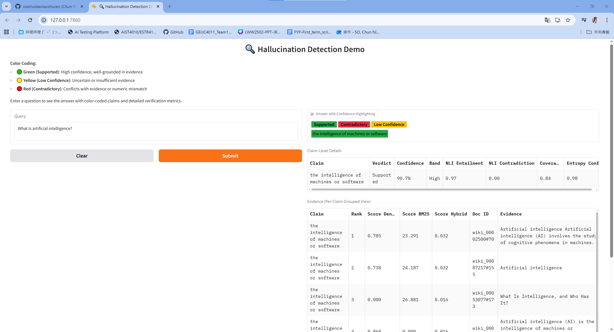

# LWW2502 - Progress Presentation
Date: 2026-02-02

## Part 1: What we've done last 2 weeks
-  Implement the following features
    - BM25 and hybrid retrieval
    - Tiered entity matching
    - Hallucination mitigation
-  Implement UI display (using Gradio)

-  Fix the following bugs
    - NLI key mismatch
    - missing generator logits
    - Not able to get the actual primary evidence

## Part 2: What we're doing next 2 weeks
-  Evaluation (to be done by Barry)
    -  RAGTruth
    -  Citebench
-  Implement any enhancement based on evaluation results
-  Fix any bugs found during evaluation

