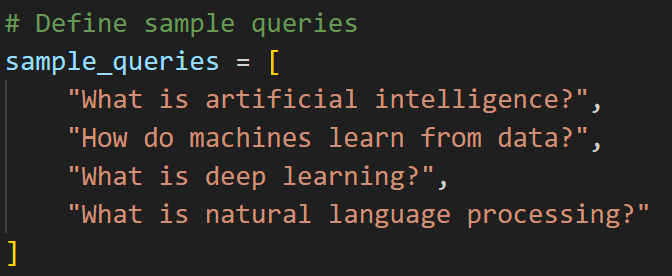
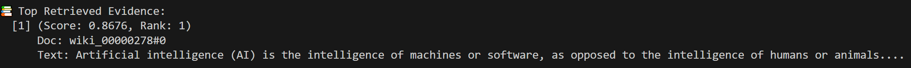
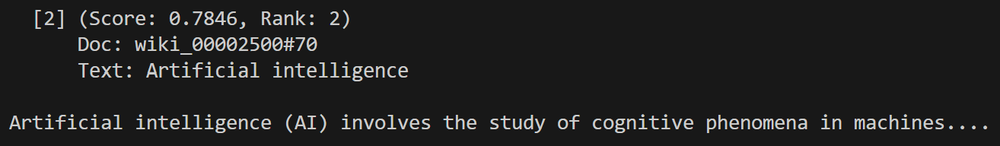
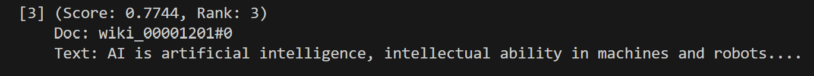
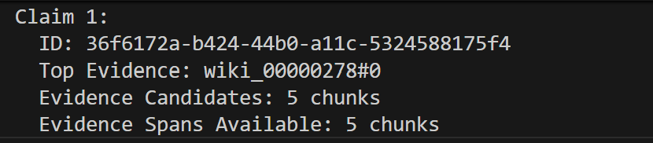
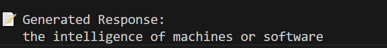

# LWW2502 - Progress Presentation
Date: 2025-11-10

## Part 1: System Architecture Design Snippets

## Part 2: RAG Pipeline & Demo

-   **Inputs:**
    -   `user_query`: (string) The input prompt from the user.
-   **Process:**
    1.  **Retrieve:** The retriever fetches relevant documents.
    2.  **Generate:** The generator LLM produces a draft response, while capturing token-level metadata (e.g., logits for entropy calculation).
    3.  **Decompose & Pair:** The draft is decomposed into atomic claims, creating direct `(claim, evidence)` pairs.
-   **Outputs:**
    -   `draft_response`: (string) The full, unverified draft response.
    -   `claim_evidence_pairs`: (List[dict]) A list where each dictionary contains the `claim`, the `evidence` document, and `generator_metadata`.

-   **Demo**
    - Sample Query:
    
    - Retrieve
    1. Top k Evidence
    
    
    
    2. Claims
    
    - Generate
    

## Part 3: Verifier Module
-   **Inputs:**
    -   `claim_evidence_pairs`: (List[dict]) The list of `(claim, evidence)` pairs with generator metadata.

-   **Process & Sub-components:**
    1.  For each `(claim, evidence)` pair, the following sub-components run in parallel:
        -   **Intrinsic Uncertainty:** Analyzes `generator_metadata`.
            -   **Output:** `entropy_score` (e.g., length-normalized negative log-likelihood).
        -   **Self-Agreement:** If enabled, generates `k` response samples.
            -   **Output:** `consistency_score` (e.g., variance or disagreement across samples).
        -   **Retrieval-Grounded Heuristics:**
            -   **Process:** Calculates `evidence_coverage` (percentage of claim entities in evidence) and `citation_integrity` (token overlap for cited spans).
            -   **Output:** A dictionary of heuristic scores.
        -   **Zero-Shot NLI:** Uses an off-the-shelf NLI model.
            -   **Process:** Labels each `(claim, evidence_sentence)` pair as Entail/Contradict/Neutral.
            -   **Output:** Aggregated NLI scores (e.g., `max_contradiction_prob`, `entailment_ratio`).
    2.  **Rule-Based Aggregator:** Gathers all signals into a structured breakdown using explicit rules. No trainable fusion logic is used at this stage.

-   **Outputs:**
    -   `verified_claims`: (List[dict]) A list where each dictionary contains:
        -   `claim`: (string) The original atomic claim.
        -   `evidence`: (dict) The associated evidence.
        -   `confidence_breakdown`: (dict) A structured dictionary containing all raw signals (e.g., `entropy_score`, `nli_results`, `coverage_score`).
        -   `final_verdict`: (string) A final verdict (e.g., "Supported", "Contradictory", "Low Confidence") derived from the rule-based aggregator.
    
